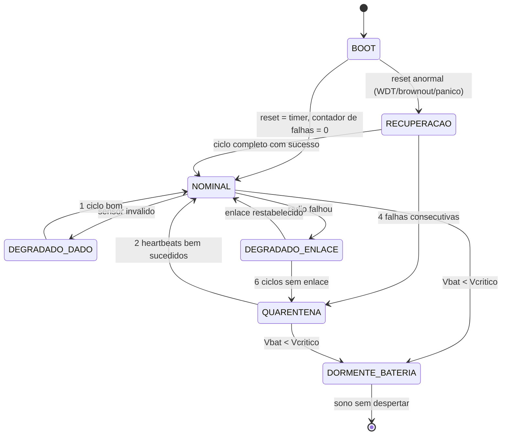

# Kaelix — Análise de Modos de Falha e Definição de Estados Seguros

Documento de segurança funcional do firmware Kaelix.
Base de código analisada: `src/` e `lib/` na revisão atual (superloop de um disparo,
modelo treinado e embarcado — `N_TREES = 100` —, leitura I2C do MPU6050 ainda
`NotImplemented`, pinos ainda marcados como `TODO`).

Método: FMEA de projeto enxuta, no espírito da IEC 60812:2018 (priorização por matriz
severidade × detectabilidade, **sem** RPN — números de ocorrência inventados não se
sustentam numa banca), com os princípios de determinismo, cota de laço e estado seguro
que DO-178C, ARP4761 e JSF++ exigem. O objetivo **não** é certificação: é que cada
decisão de projeto tenha uma razão escrita e rastreável.

---

## 1. Função, falha e classes de severidade

**Função do Kaelix (FUNC-1):** a cada 12 minutos, produzir uma caracterização confiável
do estado de vibração e temperatura de uma máquina e entregá-la ao gateway, dentro de um
orçamento de ~309 µA médio, por ~8,8 meses sem intervenção humana.

Falha é qualquer desvio dessa função. Para este dispositivo a falha mais grave **não** é
parar de funcionar — é continuar funcionando de forma aparentemente correta enquanto
produz dados que não mediu. Um dispositivo mudo é percebido; um dispositivo que mente é
acreditado.

### Classes de severidade

| Classe | Nome | Critério | Consequência típica |
|---|---|---|---|
| **S3** | Crítica | O gateway recebe dado inválido e o aceita como válido | Decisão de manutenção errada: máquina defeituosa declarada sadia, ou parada desnecessária |
| **S2** | Maior | Perda prolongada de função sem indicação, ou perda de energia que reduz a autonomia em mais de 50% | Dispositivo morre em campo; ninguém sabe quando nem por quê |
| **S1** | Moderada | Perda de um ou poucos ciclos, recuperável | Lacuna de 10 a 30 min na série temporal |
| **S0** | Menor | Sem efeito sobre a função ou sobre o orçamento de energia | — |

### Classes de detectabilidade (situação **atual**, não a desejada)

| Classe | Significado |
|---|---|
| **D-A** | O dispositivo detecta, classifica e reporta a falha |
| **D-B** | O dispositivo não detecta, mas o gateway consegue inferir a falha com os dados que já recebe |
| **D-C** | Silenciosa: nem o dispositivo nem o gateway têm como saber |

### Matriz de criticidade

Prioridade = combinação de severidade e detectabilidade atual. **S3/D-C é a categoria que
precisa desaparecer primeiro** — é a definição operacional de "falha perigosa não
detectada".

| | D-A | D-B | D-C |
|---|---|---|---|
| **S3** | Média | Alta | **Crítica** |
| **S2** | Baixa | Média | **Alta** |
| **S1** | Baixa | Baixa | Média |

---

## 2. Sumário dos modos de falha

| ID | Componente | Modo de falha | Sev. | Detecção hoje | Prioridade |
|---|---|---|---|---|---|
| FM-01 | MPU6050 / I2C | Ausente — não responde ao endereço 0x68 | S3 | D-C | **Crítica** |
| FM-02 | MPU6050 / I2C | Emudece no meio da rajada de 512 amostras | S3 | D-C | **Crítica** |
| FM-03 | MPU6050 / I2C | Barramento travado (SDA/SCL preso em nível baixo) | S2 | D-C | **Alta** |
| FM-04 | MPU6050 | Responde, mas devolve valor constante ou saturado (±16 g) | S3 | D-C | **Crítica** |
| FM-05 | Fixação mecânica | Sensor solto do corpo da máquina | S3 | D-C | **Crítica** |
| FM-06 | NTC / ADC | Termistor aberto (fio rompido, solda fria) | S3 | D-C | **Crítica** |
| FM-07 | NTC / ADC | Termistor em curto ou divisor em curto para GND | S3 | D-C | **Crítica** |
| FM-08 | NTC / ADC | Leitura feita antes do divisor estabilizar | S3 | D-C | **Alta** |
| FM-09 | SX1278 / SPI | `begin()` falha — rádio ausente, SPI mudo ou frequência rejeitada | S1 | D-B | Média |
| FM-10 | SX1278 / SPI | `sleep()` falha e o retorno é descartado — rádio fica em standby | S2 | D-C | **Alta** |
| FM-11 | Enlace LoRa | Pacote perdido no ar (alcance, colisão, interferência) | S1 | D-B | Baixa |
| FM-12 | Enlace LoRa | Colisão sistemática entre dois Kaelix na mesma planta | S2 | D-B | Média |
| FM-13 | Enlace LoRa | Dado corrompido que passa no CRC-16 | S3 | D-C | Média |
| FM-14 | Sistema | Dispositivo morto — silêncio indistinguível de perda de pacote | S2 | D-B | **Alta** |
| FM-15 | Bateria | Tensão abaixo do mínimo — brownout durante o TX | S2 | D-C | **Alta** |
| FM-16 | Bateria | Descarga profunda irreversível da célula LiPo | S2 | D-C | **Alta** |
| FM-17 | Firmware | Travamento — laço bloqueante sem watchdog | S2 | D-C | **Alta** |
| FM-18 | Firmware | Reset em laço consumindo a bateria a 40 mA | S2 | D-C | **Alta** |
| FM-19 | Isolation Forest | Árvore corrompida — travessia sem cota de profundidade | S2 | D-C | **Alta** |
| FM-20 | Isolation Forest | Índice de feature fora de faixa — leitura fora dos limites | S3 | D-C | **Crítica** |
| FM-21 | Isolation Forest | `n_trees == 0` / ponteiro nulo — divisão por zero e deref | S2 | D-C | **Alta** |
| FM-22 | Isolation Forest | Modelo placeholder: veredito sempre `Normal` | S3 | D-C | **Crítica** |
| FM-23 | Inferência | Feature NaN — comparação falha para o lado "Normal" | S3 | D-C | **Crítica** |
| FM-24 | Deep sleep | Não desperta — silêncio permanente | S2 | D-B | **Alta** |
| FM-25 | Deep sleep | `minutes == 0` ou wakeup mal configurado — acorda de imediato | S2 | D-C | **Alta** |
| FM-26 | Corte de energia | Load switch não corta — periféricos alimentados durante o sleep | S2 | D-C | **Alta** |
| FM-27 | Corte de energia | Pull-ups do I2C alimentam o MPU6050 pelos pinos de sinal | S2 | D-C | ~~Média~~ eliminada por projeto |
| FM-28 | Temperatura | Ambiente acima de +85 °C — fora da faixa do SoC e da célula | S2 | D-B | Média |
| FM-29 | Temperatura | Ambiente abaixo de 0 °C — resistência interna da célula sobe | S2 | D-C | Média |
| FM-30 | Processamento | FFT com `n` que não é potência de 2 — espectro silenciosamente errado | S3 | D-C | Média |
| FM-31 | Memória | `std::vector` por ciclo — fragmentação e `bad_alloc` não tratado | S2 | D-C | **Alta** |
| FM-32 | Memória | `new Module(...)` em inicialização estática — falha antes de `main()` | S2 | D-C | Média |
| FM-33 | Telemetria | `boot_count` zera em qualquer reset que não seja saída do deep sleep | S2 | D-C | **Alta** |
| FM-34 | Telemetria | Causa do reset nunca é lida nem reportada | S2 | D-C | **Alta** |
| FM-35 | Amostragem | Jitter na taxa de 1 kHz — frequência dominante enviesada | S3 | D-C | Média |
| FM-36 | Tempo | Sem carimbo de tempo no dispositivo | S1 | D-B | Baixa |

---

## 3. FMEA detalhada

Cada item traz o requisito de segurança derivado (`REQ-SEG-nn`), que é o elo de
rastreabilidade da seção 9.

---

### Grupo A — Aquisição de vibração (MPU6050 / I2C)

#### FM-01 — MPU6050 ausente: não responde ao endereço 0x68

- **Causa:** conector solto, solda fria, sensor não populado, rail +3V3_SW que não voltou depois do sono, pull-ups do I2C ausentes.
- **Efeito local:** `sensors::vibration_init()` devolve `false`. Hoje isso está sempre acontecendo: `src/sensors/vibration.cpp:17` retorna `false` incondicionalmente, e `vibration_read_features()` produz features sobre um buffer de zeros (`src/sensors/vibration.cpp:21`).
- **Efeito no sistema:** **este é o modo de falha mais grave do projeto.** `src/main.cpp:33-35` apenas imprime no `Serial` — que em campo não vai a lugar nenhum — e segue adiante. O ciclo transmite `rms = 0.0`, `status = Normal`, CRC íntegro. O gateway recebe um pacote perfeitamente formado dizendo que a máquina está sadia e parada. Não há como distinguir isso de uma máquina realmente desligada. **Dado fabricado apresentado como medição.** S3.
- **Como é detectado hoje:** não é. O retorno de `vibration_init()` não altera nenhum comportamento observável de fora do dispositivo.
- **Mitigação:**
  - **REQ-SEG-01** — Nenhum campo do pacote pode conter valor que o dispositivo não mediu. Cada campo de medição tem um bit correspondente em uma máscara de validade transmitida; campo inválido vai com o bit zerado e conteúdo definido (0), nunca com valor plausível.
  - **REQ-SEG-02** — `vibration_init()` deve confirmar a presença do sensor lendo `WHO_AM_I` (0x75, esperado 0x68/0x70) e comparar com o valor esperado, não apenas concluir a transação I2C.
  - **REQ-SEG-03** — Falha de inicialização de sensor leva o ciclo ao estado `DEGRADADO-DADO` (seção 5), que transmite com `status = DEGRADED` e código de falha, e não executa a inferência.

#### FM-02 — MPU6050 emudece no meio da rajada de 512 amostras

- **Causa:** ESD, glitch de alimentação durante o TX, aquecimento, vibração afrouxando o conector.
- **Efeito local:** parte das amostras é lida e o restante devolve `0xFF` ou timeout. A leitura I2C do core Arduino do ESP32 tem timeout padrão de ~50 ms por transação. 512 amostras em timeout = até ~25 s de fase ativa contra os 3 s orçados — 8 vezes o orçamento de energia do ciclo, e mais que qualquer janela de watchdog razoável.
- **Efeito no sistema:** um sinal metade real, metade lixo produz RMS, curtose e FFT sem significado físico, transmitidos como medição válida. S3. E a fase ativa estendida corrói a autonomia.
- **Como é detectado hoje:** não é. A leitura ainda não existe; quando existir, nada no desenho atual conta erros de transação.
- **Mitigação:**
  - **REQ-SEG-04** — A rajada conta transações falhas. Acima de 1% das amostras (5 de 512), o bloco inteiro é declarado inválido; features de vibração não são calculadas nem transmitidas como válidas.
  - **REQ-SEG-05** — A rajada tem prazo absoluto (deadline) de 1,5 s. Estourado o prazo, aborta e devolve erro — o laço de amostragem nunca é ilimitado (JSF++ AV-197).
  - **REQ-SEG-06** — O número de amostras perdidas vai na telemetria (seção 6), para que a degradação seja visível antes de virar travamento.

#### FM-03 — Barramento I2C travado (SDA ou SCL preso em nível baixo)

- **Causa:** escravo que perdeu a sincronia de clock e segura SDA aguardando pulsos; reset do mestre no meio de uma transação.
- **Efeito local:** toda transação seguinte falha. Sem recuperação, o sensor fica inacessível até um ciclo de energia completo.
- **Efeito no sistema:** perda permanente da função de vibração, com o dispositivo aparentemente vivo. S2.
- **Como é detectado hoje:** não é.
- **Mitigação:**
  - **REQ-SEG-07** — Antes de `Wire.begin()`, o barramento é destravado: até 9 pulsos manuais em SCL com SDA em entrada, seguidos de uma condição de STOP. Cota fixa de 9 pulsos, nunca "até destravar".
  - **REQ-SEG-08** — O corte de energia dos periféricos entre ciclos já dá um ciclo de energia a cada 12 min; isso deve ser registrado como argumento de projeto — o `peripherals_power(false)` é também uma mitigação de travamento de barramento, não só de economia.

#### FM-04 — MPU6050 responde, mas devolve valor constante ou saturado

- **Causa:** MEMS danificado por choque, faixa configurada errada (±2 g com máquina que excede), registro de configuração corrompido, sensor em modo de auto-teste.
- **Efeito local:** as amostras existem, mas não representam a máquina. Amostras todas iguais fazem `compute_kurtosis` cair no ramo `m2 == 0.0` e retornar exatamente 0 (`lib/signal_processing/signal_processing.cpp:33`), e `compute_crest_factor` retornar 0 (linha 39).
- **Efeito no sistema:** features degeneradas alimentam o Isolation Forest e produzem um veredito arbitrário. S3.
- **Como é detectado hoje:** não é. Curtose exatamente 0 e fator de crista exatamente 0 são resultados matematicamente corretos para sinal constante e indistinguíveis de resultado válido no formato atual do pacote.
- **Mitigação:**
  - **REQ-SEG-09** — Verificação de plausibilidade do bloco: variância nula, saturação em mais de 1% das amostras e RMS abaixo do piso de ruído do sensor invalidam o bloco.
  - **REQ-SEG-10** — Os ramos degenerados (`m2 == 0`, `rms == 0`) devem sinalizar "indefinido" ao chamador em vez de devolver 0 — 0 é um valor legítimo do domínio e não pode servir de código de erro (violação nº 3, modelo de erro).

#### FM-05 — Sensor fisicamente solto do corpo da máquina

- **Causa:** adesivo/parafuso cedendo por vibração e ciclo térmico.
- **Efeito local:** o acelerômetro mede o próprio invólucro balançando, não a máquina.
- **Efeito no sistema:** série temporal plausível, fisicamente falsa; a assinatura de desbalanceamento desaparece. S3. É a falha que a instrumentação de vibração industrial mais teme, e nenhum software a detecta diretamente.
- **Como é detectado hoje:** não é.
- **Mitigação:**
  - **REQ-SEG-11** — Monitorar o vetor gravidade (componente DC dos três eixos): módulo distante de 1 g ou mudança abrupta de orientação entre ciclos indica montagem comprometida; sinalizar `MOUNT_SUSPECT` na telemetria.
  - Mitigação principal é de processo, não de software: torque e inspeção de fixação no procedimento de instalação.

---

### Grupo B — Temperatura (NTC 10k / ADC)

#### FM-06 — Termistor aberto

- **Causa:** fio rompido pela vibração, solda fria, conector oxidado.
- **Efeito local:** o nó de leitura é puxado para Vcc pelo resistor fixo de 10 k. `ntc_resistance_from_adc` (`lib/thermistor/thermistor.cpp:10-12`) satura a razão em 0,999 e devolve até 9,99 MΩ.
- **Efeito no sistema:** com os parâmetros atuais (beta 3950, R nominal 10 k, 25 °C), a conversão produz **cerca de −26 °C** para leitura no topo de escala do ADC (~3100 mV) e **−77 °C** no limite absoluto do clamp. São `float` finitos, passam pelo CRC e chegam ao gateway como temperatura. S3.
- **Como é detectado hoje:** não é. O clamp em `thermistor.cpp` foi escrito para evitar divisão por zero e, sem querer, **converte uma falha de hardware detectável em um número plausível** — o clamp esconde exatamente a informação que denunciaria a falha.
- **Mitigação:**
  - **REQ-SEG-12** — O clamp deixa de ser silencioso: razão fora de [0,02; 0,98] é falha de sensor (aberto/curto) e retorna erro, não um valor saturado.
  - **REQ-SEG-13** — Faixa de plausibilidade da temperatura no dispositivo: leitura fora de [−40 °C, +125 °C] invalida o campo (bit de validade zerado).

#### FM-07 — Termistor em curto ou divisor em curto para GND

- **Causa:** solda escorrida, esmagamento do cabo, umidade.
- **Efeito local:** razão vai a zero, clamp em 0,001, resistência ≈ 10 Ω.
- **Efeito no sistema:** a conversão devolve **+349 °C**. Novamente um `float` finito, com CRC válido, indistinguível de leitura real no formato de pacote atual. Se o gateway tiver alarme de sobretemperatura, dispara uma parada de máquina por causa de uma solda ruim. S3.
- **Como é detectado hoje:** não é.
- **Mitigação:** REQ-SEG-12 e REQ-SEG-13.

#### FM-08 — Leitura feita antes de o divisor estabilizar

- **Causa:** o divisor do NTC é alimentado pelo mesmo rail +3V3_SW do MPU6050 (`src/power/sleep.cpp:14-32`). `PERIPHERAL_SETTLE_MS = 100` (`src/main.cpp:18`) é uma estimativa, não uma medição. Se a constante de tempo do nó (capacitância de filtro × 10 k) for maior, a leitura pega o transitório.
- **Efeito local:** temperatura enviesada para baixo (nó ainda subindo).
- **Efeito no sistema:** deriva sistemática em todas as leituras, invisível porque é consistente. S3 por ser um erro sistemático não detectável.
- **Como é detectado hoje:** não é.
- **Mitigação:**
  - **REQ-SEG-14** — O tempo de estabilização é medido no banco (osciloscópio no nó do divisor) e o valor adotado é o medido com margem de 3×, registrado com a evidência. Enquanto não medido, permanece como premissa aberta (seção 10).
  - **REQ-SEG-15** — Média de N leituras consecutivas com descarte da primeira, e verificação de que a dispersão entre elas está abaixo de um limite (leituras instáveis = ainda em transitório).

---

### Grupo C — Enlace de rádio (SX1278 / SPI / LoRa)

#### FM-09 — `begin()` falha: rádio ausente, SPI mudo ou frequência rejeitada

- **Causa:** módulo não populado, CS/RST/DIO0 nos pinos errados (ainda `TODO` em `src/comms/lora.cpp:10-13`), SPI sem clock, cristal de 32 MHz fora de especificação fazendo `begin(433.0)` devolver `RADIOLIB_ERR_INVALID_FREQUENCY`.
- **Efeito local:** `lora_init()` devolve `false` (`src/comms/lora.cpp:45-51`), colapsando três causas distintas — versão de chip errada (`RADIOLIB_ERR_CHIP_NOT_FOUND`, −2), SPI mudo, e frequência rejeitada (−12) — em um único bit. É exatamente a violação nº 3 do levantamento: o valor de `state` existe, tem a informação, e é jogado fora na linha seguinte.
- **Efeito no sistema:** `src/main.cpp:51` pula a transmissão. O ciclo é medido e descartado; 12 minutos de dados perdidos por ciclo. Se a causa for permanente, o dispositivo fica **completamente mudo para sempre** e a manutenção não tem informação alguma para diagnosticar sem ir até a máquina. S1 por ciclo, S2 se persistente.
- **Como é detectado hoje:** D-B — o gateway percebe o silêncio, mas não sabe a causa nem se o dispositivo está vivo.
- **Mitigação:**
  - **REQ-SEG-16** — Modelo de erro tipado substituindo `bool`: um `enum class Error : uint8_t` por subsistema, propagado até o topo e **transmitido** no campo `fault_code` (seção 6). "Rádio ausente", "SPI mudo" e "frequência rejeitada" precisam ser distinguíveis do lado do gateway.
  - **REQ-SEG-17** — Rotina de recuperação antes de desistir: pulso de reset por hardware no pino RST, nova tentativa, no máximo 2 vezes (cota fixa).
  - **REQ-SEG-18** — Medições que não puderam ser transmitidas são guardadas em um buffer circular na RTC slow memory (8 KB disponíveis; ~40 registros de 12 bytes = quase 7 h de histórico) e enviadas em rajada quando o enlace voltar.

#### FM-10 — `lora_sleep()` falha e o retorno é descartado

- **Causa:** rádio em estado inconsistente, SPI intermitente, `lora_init()` falhou e `main.cpp:61` chama `lora_sleep()` sobre um rádio que nunca respondeu.
- **Efeito local:** `bool lora_sleep()` devolve `false` e **`src/main.cpp:61` ignora o retorno**. O SX1278 permanece em standby.
- **Efeito no sistema:** o próprio código documenta a conta (`src/comms/lora.h:51-56` e `src/power/sleep.cpp:32-33`): standby custa 1,5 mA durante 720 s = 1080 mA·s por ciclo, contra 174 mA·s do ciclo inteiro. O consumo efetivo sobe de 309 µA para ~1,83 mA e a autonomia cai de ~269 dias para **~48 dias**. O dispositivo morre em campo seis meses antes do previsto, e nada indica o porquê. S2, e é a maior ameaça isolada ao orçamento de energia.
- **Como é detectado hoje:** não é. Não há medição de bateria; a única evidência seria o dispositivo morrer cedo.
- **Mitigação:**
  - **REQ-SEG-19** — O retorno de `lora_sleep()` é obrigatoriamente verificado. `[[nodiscard]]` em todas as funções que reportam falha.
  - **REQ-SEG-20** — Fallback de hardware: se `sleep()` não confirmar, o pino RST é mantido em nível ativo antes do deep sleep, forçando o rádio ao estado de menor consumo independentemente do estado do firmware do módulo.
  - **REQ-SEG-21** — O evento entra no `fault_code` do próximo pacote — uma vez que o rádio volte, o gateway fica sabendo que houve um ciclo com fuga de corrente.
  - **INV-1** (invariante, seção 5): o rádio nunca entra no período de sleep em standby.

#### FM-11 — Pacote perdido no ar

- **Causa:** alcance, obstrução metálica, interferência em 433 MHz, desvanecimento.
- **Efeito local:** `transmit()` retorna sucesso — o SX1278 confirma que emitiu, não que alguém recebeu. Não há ACK.
- **Efeito no sistema:** lacuna de um ciclo. `boot_count` permite ao gateway detectar a lacuna depois. S1.
- **Como é detectado hoje:** D-B, pela descontinuidade de `boot_count`. Este é um ponto em que o projeto já acertou.
- **Mitigação:**
  - **REQ-SEG-22** — Manter o envio sem ACK (ACK custaria janela de RX e energia), e compensar com REQ-SEG-18: reenviar as últimas N leituras junto com a atual, de forma que uma perda isolada seja recuperada no ciclo seguinte sem transmissão adicional.

#### FM-12 — Colisão sistemática entre dois Kaelix na mesma planta

- **Causa:** `lora_init()` não configura sync word, spreading factor, largura de banda, coding rate nem preâmbulo — todos ficam nos padrões do RadioLib. Dois dispositivos acordam por timers independentes de 12 min; se as janelas se aproximarem, a deriva relativa dos osciladores é pequena e elas podem ficar sobrepostas por dezenas de ciclos seguidos.
- **Efeito local:** ambos transmitem, nenhum é decodificado.
- **Efeito no sistema:** dois dispositivos ficam mudos simultaneamente e de forma persistente. S2.
- **Como é detectado hoje:** D-B, e apenas se alguém correlacionar os silêncios.
- **Mitigação:**
  - **REQ-SEG-23** — Parâmetros de rádio explicitamente fixados no código (SF, BW, CR, sync word, preâmbulo, potência) — nunca herdados de padrão de biblioteca, para que o pacote no ar seja determinístico e rastreável a uma linha de código.
  - **REQ-SEG-24** — Dispersão pseudoaleatória do instante de despertar: ±15 s derivados do `device_id`, o que descorrelaciona permanentemente as janelas de dispositivos diferentes ao custo de nada em energia.

#### FM-13 — Dado corrompido que passa no CRC-16

- **Causa:** o CRC-16/CCITT (`lib/crc16/crc16.cpp`) detecta todas as rajadas de até 16 bits e deixa passar ~1 em 65536 dos padrões restantes. O LoRa já tem CRC próprio na camada física; este é o CRC fim-a-fim.
- **Efeito local:** pacote aceito com um `float` alterado.
- **Efeito no sistema:** leitura errada aceita como boa. S3, mas com probabilidade baixa e com defesa já existente.
- **Como é detectado hoje:** parcialmente — o CRC existe, é testado no host, e usa o vetor de conferência padrão (`crc16_ccitt("123456789") == 0x29B1`). Boa prática já aplicada.
- **Mitigação:**
  - **REQ-SEG-25** — Faixas de plausibilidade no gateway como segunda barreira: RMS, temperatura e frequência dominante fora de faixa física derrubam o pacote mesmo com CRC válido. Defesa em profundidade, custo zero no dispositivo.

#### FM-14 — Dispositivo morto, silêncio indistinguível de perda de pacote

- **Causa:** qualquer falha terminal — bateria esgotada, travamento sem watchdog, deep sleep sem despertar, dano físico.
- **Efeito local:** nenhum pacote é emitido.
- **Efeito no sistema:** o gateway vê silêncio. Como não existe cadência declarada nem heartbeat, o silêncio de um dispositivo morto é igual ao de um dispositivo com o rádio momentaneamente ruim. S2.
- **Como é detectado hoje:** D-B, e só se o operador do gateway estiver ativamente esperando pacotes daquele `device_id`.
- **Mitigação:**
  - **REQ-SEG-26** — O gateway monitora cadência: ausência por mais de 2 períodos consecutivos gera alarme de dispositivo. É regra de gateway, mas é requisito de segurança do sistema e precisa estar escrito aqui.
  - **REQ-SEG-27** — Todo estado do dispositivo, inclusive os degradados, mantém emissão periódica (ver seção 5, INV-4: "sempre audível"). Um Kaelix que decide se calar é indistinguível de um Kaelix quebrado; nenhum estado seguro pode ser mudo, exceto o de proteção terminal da bateria — e esse é anunciado antes de ser entrado.

---

### Grupo D — Energia e bateria

#### FM-15 — Tensão abaixo do mínimo: brownout durante o TX

- **Causa:** o TX a 17 dBm puxa ~90-120 mA. Com a célula perto do fim, resistência interna alta e o dropout do HT7333, o trilho afunda no instante do pulso de transmissão. O detector de brownout do ESP32-S3 dispara reset.
- **Efeito local:** reset no meio da transmissão. O ciclo recomeça, energiza os periféricos, amostra, e transmite de novo — provocando outro brownout.
- **Efeito no sistema:** **laço de brownout**: o dispositivo passa a operar em fase ativa quase contínua a ~40 mA em vez de 309 µA, queimando a carga residual em horas e destruindo qualquer chance de a última mensagem sair. S2.
- **Como é detectado hoje:** não é. `esp_reset_reason()` nunca é chamado; não há medição de tensão.
- **Mitigação:**
  - **REQ-SEG-28** — `esp_reset_reason()` é lido nas primeiras linhas de `setup()`. Reset por brownout ou por pânico **não** repete o ciclo normal: entra na escalada de falhas da seção 5.
  - **REQ-SEG-29** — Medir a tensão da bateria antes de decidir transmitir. Abaixo de um limiar operacional (a definir com a curva real da célula; ponto de partida 3,45 V sob carga), reduzir a potência de TX para 10 dBm; abaixo do limiar crítico, não transmitir em 17 dBm de forma alguma.
  - **REQ-SEG-30** — Capacitor de reservatório (centenas de µF) próximo ao módulo de rádio dimensionado para o pulso de TX. Mitigação de hardware — a de software sozinha não resolve.

#### FM-16 — Descarga profunda irreversível da célula

- **Causa:** o dispositivo continua tentando cumprir a função até a célula chegar abaixo da tensão de corte. Sem BMS com corte confiável, a LiPo sofre dano permanente.
- **Efeito local:** célula inutilizada.
- **Efeito no sistema:** perda do dispositivo e do ativo, não só do ciclo. S2.
- **Como é detectado hoje:** não é.
- **Mitigação:**
  - **REQ-SEG-31** — Estado `DORMENTE-BATERIA` (seção 5): abaixo do limiar crítico, o dispositivo emite um último pacote anunciando o desligamento e entra em deep sleep **sem timer de despertar**. Esta é a única situação em que o silêncio é o comportamento seguro, e ela é anunciada antes de acontecer.

---

### Grupo E — Execução do firmware

#### FM-17 — Travamento: laço bloqueante sem watchdog

- **Causa:** travessia de árvore sem cota (FM-19), rajada I2C que nunca completa (FM-02/FM-03), `transmit()` bloqueante do RadioLib esperando DIO0 que nunca sobe porque o pino está errado (`src/comms/lora.cpp:12`, ainda `TODO`).
- **Efeito local:** `setup()` nunca chega a `deep_sleep()`. A CPU fica em fase ativa a ~40 mA indefinidamente.
- **Efeito no sistema:** dispositivo mudo **e** consumindo 115 vezes o orçamento. A bateria de 2000 mAh acaba em ~50 h. Ninguém percebe até o silêncio ser notado, e a essa altura já não há energia nem para reportar. S2.
- **Como é detectado hoje:** não é. Não há watchdog armado (violação nº 5).
- **Mitigação:** política completa na seção 5. **REQ-SEG-32** — RTC WDT armado antes de qualquer periférico ser energizado.

#### FM-18 — Reset em laço consumindo a bateria

- **Causa:** consequência direta da mitigação de FM-17 mal desenhada. Se o watchdog reinicia e o firmware volta a travar no mesmo ponto, o ciclo é travar → resetar → travar.
- **Efeito local:** boots consecutivos.
- **Efeito no sistema:** com janela de 15 s a ~40 mA, 2000 mAh se esgotam em ~50 h. **O reset, sozinho, não é um estado seguro** — é uma máquina de destruir bateria. Este é o argumento central da seção 5. S2.
- **Como é detectado hoje:** não é. Pior: `boot_count` está em `RTC_DATA_ATTR` e, como explicado em FM-33, é **zerado** em resets que não sejam saída de deep sleep — o laço de reset apagaria a própria evidência.
- **Mitigação:**
  - **REQ-SEG-33** — Contador de falhas consecutivas em `RTC_NOINIT_ATTR`, protegido por palavra mágica e CRC, com escalada obrigatória para o estado `QUARENTENA` (seção 5).

#### FM-19 — Árvore do Isolation Forest corrompida: travessia sem cota

- **Local:** `lib/isolation_forest/isolation_forest.cpp:17`
  ```cpp
  while (tree.feature[node] != -1) {
      node = (features[tree.feature[node]] < tree.threshold[node]) ? tree.left[node] : tree.right[node];
      ++depth;
  }
  ```
- **Causa:** bit flip na flash (a SPI flash externa não tem ECC por padrão), exportador de modelo com defeito gerando um ciclo `left[a] = b, left[b] = a`, ou índice apontando para além do array.
- **Efeito local:** laço infinito, ou leitura fora dos limites do array. `depth` é incrementado sem teto — em uma árvore cíclica, o laço nunca termina.
- **Efeito no sistema:** travamento permanente a 40 mA (ver FM-17). S2, e é a violação nº 2 do levantamento confirmada.
- **Como é detectado hoje:** não é.
- **Mitigação:**
  - **REQ-SEG-34** — Cota de profundidade explícita: `for (int d = 0; d < MAX_TREE_DEPTH; ++d)`, com `MAX_TREE_DEPTH` derivado de `ceil(log2(SUBSAMPLE_SIZE)) + margem` (com `SUBSAMPLE_SIZE = 256`, um limite de 32 é folgado). Estourar a cota é falha declarada, não veredito.
  - **REQ-SEG-35** — CRC-16 sobre o blob do modelo, calculado na exportação, embarcado como constante e verificado uma vez em `model_init()`. Modelo com CRC divergente = subsistema de inferência indisponível, e o dispositivo transmite features sem veredito em vez de um veredito falso.

#### FM-20 — Índice de feature fora de faixa

- **Local:** mesma linha. `features[tree.feature[node]]` — `tree.feature[node]` é `int16_t` e nada garante que esteja em [0, `N_FEATURES`). `node` também é `int16_t` e pode ser negativo, indexando `tree.feature[node]` **antes** do início do array.
- **Causa:** as mesmas de FM-19.
- **Efeito local:** leitura de memória arbitrária. No ESP32-S3 não há MMU protegendo essa região do jeito que se esperaria em um host; a leitura provavelmente **não** gera exceção — devolve lixo interpretado como `float`.
- **Efeito no sistema:** um score de anomalia calculado sobre bytes aleatórios da RAM, transmitido como veredito. É pior que travar: **o travamento é detectável, o veredito falso não é.** S3.
- **Como é detectado hoje:** não é. Não há uma única asserção nem validação de índice no módulo (violação nº 4 confirmada).
- **Mitigação:**
  - **REQ-SEG-36** — Validação de faixa em cada passo: `feature ∈ [0, N_FEATURES)`, `node ∈ [0, n_nodes)`. Índice fora de faixa aborta a travessia e devolve erro.
  - **REQ-SEG-37** — `n_nodes` passa a ser campo da `struct IsolationTree`. Hoje a struct carrega cinco ponteiros e uma raiz, e **nenhum tamanho** — é estruturalmente impossível validar um índice contra um array cujo tamanho não se conhece. Esta é uma falha de projeto do tipo de dado, não do laço.

#### FM-21 — `n_trees == 0` ou ponteiro de árvores nulo

- **Local:** `lib/isolation_forest/isolation_forest.cpp:29` — `total_path / float(n_trees)`; e `src/ml/isolation_forest_data.h` declara `isolation_forest_trees = nullptr`.
- **Causa:** chamar `isolation_forest_score()` no estado atual do repositório.
- **Efeito local:** divisão de 0,0 por 0,0 = NaN, e `trees[i]` desreferencia o ponteiro nulo antes disso.
- **Efeito no sistema (análise original):** `model.cpp` protegia com uma guarda no **chamador** — convenção documentada em comentário, não propriedade da função. Qualquer outro chamador (um teste, um refactor futuro) quebrava. S2.
- **Como é detectado hoje:** **mitigado.** `isolation_forest_score` valida as próprias pré-condições (`isolation_forest.cpp:129-139`): ponteiros nulos ⇒ `NullPointer`, `subsample_size <= 1` ⇒ `InvalidArgument`, `n_trees <= 0` ⇒ `ModelAbsent`. A guarda passou para o provedor do serviço, e `model.cpp:35` a complementa com `isolation_forest_validate`.
- **Mitigação:**
  - **REQ-SEG-38** — Validação de pré-condição dentro da própria função: `trees != nullptr && n_trees > 0 && subsample_size > 1`, devolvendo erro tipado. A guarda pertence ao provedor do serviço, não ao consumidor (princípio de contrato defensivo em fronteira de módulo).

#### FM-22 — Modelo ausente confundido com veredito `Normal` — **mitigado**

- **Local:** `src/ml/model.cpp:35` e `:59` (guarda `N_TREES <= 0`); `src/ml/isolation_forest_data.h:12` (hoje `N_TREES = 100`).
- **Causa (original):** o treino ainda não havia gerado as árvores, e a guarda devolvia `Normal`.
- **Efeito local (original):** `model_init()` devolvia falso e `model_infer()` devolvia `Normal` sempre.
- **Estado atual:** as duas metades foram fechadas. A guarda devolve `Status::ModelAbsent` (`0x30`, `"NO_MODEL"`) e deixa o veredito em `MachineState::Unknown` — nunca `Normal`. E o modelo treinado no MAFAULDA está embarcado, então o caminho da guarda deixou de ser o normal. O `diag` do pacote carrega o código ao gateway.
- **Efeito no sistema:** todo pacote sai com `status = Normal`. O gateway não tem como saber que **não há modelo embarcado**: um "Normal" sem modelo é byte a byte idêntico a um "Normal" com modelo. Um dispositivo com firmware de desenvolvimento instalado por engano em uma máquina real declara-a sadia para sempre. S3, e a mesma classe de FM-01: **dado fabricado com aparência de medição**.
- **Como é detectado hoje:** não é. A mensagem existe, mas só no `Serial` (`src/main.cpp:40`).
- **Mitigação:**
  - **REQ-SEG-39** — `Status` deixa de ser binário. Passa a ter, no mínimo: `Normal`, `Anomalous`, `Degraded` (medição parcial), `Unavailable` (sem inferência), `Fault`. `Unavailable` é o valor quando não há modelo.
  - **REQ-SEG-40** — Identificação do modelo (hash de 16 bits do blob treinado) transmitida em todo pacote. Sem ela, não há rastreabilidade entre um veredito de campo e o modelo que o produziu — e nenhuma análise post-mortem é possível depois de um retreino.

#### FM-23 — Feature NaN: a comparação falha para o lado "Normal"

- **Local:** `src/ml/model.cpp:24` — `return score > ANOMALY_THRESHOLD ? Status::Anomalous : Status::Normal;`
- **Causa:** qualquer NaN a montante — `dominant_frequency` sobre amostras com Inf, divisão degenerada, ponteiro lido fora de faixa (FM-20).
- **Efeito local:** **toda comparação com NaN é falsa em IEEE 754.** `NaN > threshold` é falso, então o operador ternário escolhe `Status::Normal`.
- **Efeito no sistema:** dado corrompido resulta sistematicamente em "máquina sadia". A falha tem direção: **falha para o lado inseguro**. É o pior padrão possível em uma decisão de segurança e está em uma única linha de código. S3.
- **Como é detectado hoje:** não é.
- **Mitigação:**
  - **REQ-SEG-41** — Toda comparação de decisão é escrita para falhar no sentido seguro: validar `std::isfinite(score)` **antes** de comparar, e tratar não finito como `Fault`, jamais como `Normal`.
  - **REQ-SEG-42** — `std::isfinite` em toda feature na fronteira entre processamento de sinal e inferência.

#### FM-30 — FFT com `n` que não é potência de 2

- **Local:** `lib/signal_processing/signal_processing.cpp:49` e `:88`. O cabeçalho documenta "`n` deve ser potência de 2" (`signal_processing.h:23-24`), mas **nada verifica**. `dominant_frequency` só rejeita `n < 4` (linha 90).
- **Causa:** um chamador futuro passando 500 em vez de 512; ou uma rajada abortada devolvendo menos amostras que o pedido.
- **Efeito local:** o laço de borboletas `for (len = 2; len <= n; len <<= 1)` simplesmente para cedo e a permutação bit-reversal fica inconsistente. Não há erro, não há travamento — o espectro sai **silenciosamente errado**.
- **Efeito no sistema:** frequência dominante inventada, alimentando o modelo. S3.
- **Como é detectado hoje:** não é. Não há asserção alguma no módulo (violação nº 4).
- **Mitigação:**
  - **REQ-SEG-43** — Contrato verificável: `n` potência de 2 checado em tempo de compilação onde o tamanho é constante (`static_assert`), e em tempo de execução na fronteira pública, com erro tipado.
  - **REQ-SEG-44** — Como `dominant_frequency` só é chamada com 512, o caminho correto é aceitar um tamanho de compilação (`template<size_t N>` ou parâmetro `constexpr`), o que resolve simultaneamente este item e FM-31.
- **Observação adicional:** `best_mag` inicia em −1,0 e é comparado com magnitudes; se todas forem NaN, nenhuma comparação é verdadeira e a função devolve o **bin inferior da banda** como se fosse o pico. Mais uma falha silenciosa para o lado plausível.

#### FM-31 — `std::vector` por ciclo: fragmentação e `bad_alloc` não tratado

- **Local:** `lib/signal_processing/signal_processing.cpp:92-93` (dois vetores de `n` floats = ~4 KB com n=512) e `src/sensors/vibration.cpp:21` (mais 2 KB).
- **Causa:** violação nº 1 do levantamento — alocação dinâmica depois da inicialização (JSF++ AV-206, MISRA C++ 18-4-1).
- **Efeito local:** ~6 KB de heap alocados e liberados a cada ciclo. O padrão alocar-liberar é regular, então a fragmentação é improvável aqui, mas o argumento de segurança não é probabilístico: **o tempo de execução e o sucesso da alocação deixam de ser determináveis estaticamente**, que é justamente o que DO-178C exige poder afirmar sobre uso de memória.
- **Efeito no sistema:** se a alocação falhar, com exceções habilitadas há `std::bad_alloc` não capturado → `std::terminate` → `abort` → reset; sem exceções, `abort` direto. Em ambos os casos: reset silencioso, sem diagnóstico, e potencialmente em laço (FM-18). S2.
- **Como é detectado hoje:** não é.
- **Mitigação:**
  - **REQ-SEG-45** — Buffers estáticos de tamanho fixo dimensionados para o pior caso (512 amostras), declarados em escopo de arquivo, com o consumo de RAM documentado e verificado no mapa de memória do build.
  - **REQ-SEG-46** — `-fno-exceptions` e proibição de `new`/`malloc` após a inicialização, verificada por análise estática (`clang-tidy: cppcoreguidelines-no-malloc`, `hicpp-no-malloc`) e por inspeção do mapa de link.

#### FM-32 — `new Module(...)` em inicialização estática

- **Local:** `src/comms/lora.cpp:17` — `static SX1278 radio = new Module(LORA_CS_PIN, LORA_DIO0_PIN, LORA_RST_PIN);`
- **Causa:** forma idiomática da API do RadioLib.
- **Efeito local:** alocação de heap **antes de `main()`**, num ponto em que não há nenhum tratamento de erro possível. Se falhar, o dispositivo não chega a executar uma linha do firmware.
- **Efeito no sistema:** boot morto, sem diagnóstico. S2 por severidade, baixa probabilidade.
- **Avaliação do desvio (pedida no levantamento):** **é evitável.** O construtor de `SX1278` aceita `Module*`, então o objeto pode viver em memória estática:
  ```cpp
  static Module lora_module(LORA_CS_PIN, LORA_DIO0_PIN, LORA_RST_PIN);
  static SX1278 radio(&lora_module);
  ```
  Isso elimina a alocação sem alterar a API usada. **Não deve ser registrado como desvio justificado** — deve ser corrigido. Registrar como desvio uma violação que tem correção de duas linhas enfraquece todos os outros desvios do documento.
  - **REQ-SEG-47** — Zero alocação dinâmica no projeto, inclusive em inicialização estática. Se em algum ponto futuro uma biblioteca de terceiros impuser heap sem alternativa, o desvio é registrado com: a evidência de que não há alternativa, o limite superior da alocação, e o comportamento em caso de falha.

---

### Grupo F — Sono, despertar e corte de energia

#### FM-24 — Deep sleep que não desperta

- **Causa:** falha do RTC timer, oscilador RC lento fora de faixa por temperatura extrema, corrupção do domínio RTC por transitório de tensão.
- **Efeito local:** o dispositivo permanece em deep sleep para sempre, a ~18 µA.
- **Efeito no sistema:** silêncio permanente com bateria cheia. É o modo de falha mais frustrante em campo: o dispositivo parece intacto e a bateria está boa, então o diagnóstico é demorado. S2.
- **Como é detectado hoje:** D-B, apenas pelo silêncio.
- **Mitigação:**
  - **REQ-SEG-48** — Fonte de despertar redundante: além do timer, habilitar despertar por GPIO (um botão de manutenção já resolve a intervenção em campo sem abrir o equipamento).
  - **REQ-SEG-49** — O RTC WDT permanece armado durante o deep sleep com janela de aproximadamente 1,2× o período de sono, funcionando como despertador de último recurso. **Isso muda a política da seção 5**: o RTC WDT não pode ser simplesmente desabilitado antes de dormir; a janela precisa ser reprogramada. Se for deixada em 20 s, o watchdog reinicia o chip 20 s depois de dormir e o período de 12 min nunca acontece.

#### FM-25 — `minutes == 0` ou wakeup mal configurado

- **Local:** `src/power/sleep.cpp:65-73`. `minutes` não é validado, e o retorno de `esp_sleep_enable_timer_wakeup()` (que é `esp_err_t`) é descartado.
- **Causa:** parâmetro vindo de configuração futura, erro de refactor, valor lido de NVS corrompido.
- **Efeito local:** com `minutes == 0` o chip desperta imediatamente. Com a chamada falhando e o retorno ignorado, nenhuma fonte de despertar fica habilitada e o resultado é FM-24.
- **Efeito no sistema:** dos dois lados o efeito é grave e oposto — ou ciclo contínuo a ~40 mA (bateria em ~50 h), ou sono permanente. S2. É a violação nº 4 (sem validação de parâmetro) com consequência direta sobre a função principal do dispositivo.
- **Como é detectado hoje:** não é.
- **Mitigação:**
  - **REQ-SEG-50** — Validar `minutes ∈ [1, 120]` e verificar o retorno de `esp_sleep_enable_timer_wakeup()`. Falha na configuração do despertar é um erro tratado, não um sono silencioso.

#### FM-26 — Corte de energia não atua: periféricos alimentados durante o sono

- **Local:** `src/power/sleep.cpp:57-70`. O código já trata corretamente o caso mais sutil (`gpio_hold_dis` no boot, `gpio_hold_en` + `gpio_deep_sleep_hold_en` antes de dormir, com o raciocínio escrito nos comentários — é um dos pontos fortes do código atual).
- **Causa residual:** o `hold` falhando silenciosamente porque o retorno de `gpio_hold_en()` não é verificado; Q1 (SI2301) com Vgs(th) fora da faixa de nível lógico não fechando o canal em 3,3 V. O pino e a polaridade deixaram de ser `TODO`: GPIO5 ativo-alto, conferido contra `hardware/gen_schematic.py`.
- **Efeito local:** o MPU6050 (~3,9 mA) e o divisor do NTC (~0,33 mA em 3,3 V sobre 10 k) permanecem energizados durante 720 s.
- **Efeito no sistema:** ~2,5 A·s adicionais por ciclo; o consumo médio salta de 309 µA para vários mA e a autonomia cai de 269 dias para poucos dias. Nada indica a falha, porque a leitura funciona normalmente. S2.
- **Como é detectado hoje:** não é. Sem medição de tensão da bateria, a única evidência é o dispositivo morrer antes da hora.
- **Mitigação:**
  - **REQ-SEG-51** — Verificar o retorno de `gpio_hold_en()`.
  - **REQ-SEG-52** — Verificação em banco com INA219/multímetro do consumo em sono, com critério de aceitação numérico (< 30 µA) e registro do resultado como evidência de verificação de REQ. É o tipo de "teste de projeto" que a defesa vai pedir.
  - **REQ-SEG-53** — Telemetria de tensão da bateria (seção 6) transforma esta falha silenciosa em uma inclinação anômala de descarga visível no gateway em poucos dias.

#### FM-27 — Pull-ups do I2C alimentando o MPU6050 pelos pinos de sinal

**Estado: eliminada por mudança de topologia.** Fica registrada porque é a
razão de o circuito ser o que é hoje — e porque a mitigação por software que
estava proposta (REQ-SEG-54) resolvia o sintoma, não a causa.

- **Causa (topologia antiga):** o BC337 era chave low-side — cortava o retorno a GND, mas SDA/SCL continuavam presos a +3V3 pelos resistores de pull-up. A corrente entrava pelos diodos de proteção dos pinos do MPU6050 e o alimentava parasitariamente.
- **Efeito local:** o sensor podia permanecer parcialmente energizado, com corrente de fuga pelos pull-ups (2 × 3,3 V / 4,7 kΩ ≈ 1,4 mA no pior caso, se os pinos do sensor puxassem para baixo).
- **Efeito no sistema:** mesmo efeito de FM-26 em escala menor, e o corte de energia deixava de ser garantia de reset do sensor (o que enfraquecia a mitigação REQ-SEG-08). S2 no pior caso.
- **Correção aplicada:** o corte passou a ser high-side (Q1 SI2301 comandado por Q2 BC847B), e os pull-ups R2/R3 foram movidos do rail fixo +3V3 para o rail comutado +3V3_SW. Com o rail em zero não existe fonte para o caminho parasita: os pull-ups estão do lado cortado. Ver `hardware/gen_schematic.py`, bloco "Corte de energia dos periféricos".
- **O que resta verificar:** REQ-SEG-55 continua valendo — medir a corrente em sono com o sensor populado. A topologia elimina o caminho conhecido; o ensaio é o que responde se existe outro.
- **REQ-SEG-54 fica sem objeto:** colocar SDA/SCL em nível baixo antes do sono era contornar o efeito. Com os pull-ups no rail cortado, não há o que contornar.

#### FM-28 — Temperatura ambiente acima de +85 °C

- **Causa:** montagem próxima a mancal quente, carcaça de motor, ambiente industrial.
- **Efeito local:** ESP32-S3, MPU6050 e SX1278 são especificados até +85 °C; a LiPo tem limite de descarga tipicamente em +60 °C. Acima disso: deriva de oscilador, erro do ADC, resets espúrios, e degradação acelerada ou inchaço da célula.
- **Efeito no sistema:** medições enviesadas, resets aleatórios, risco físico à célula. S2.
- **Como é detectado hoje:** D-B — o dispositivo **mede** a temperatura e a transmite, mas **não age sobre ela**. A informação existe e é desprezada.
- **Mitigação:**
  - **REQ-SEG-56** — A temperatura medida realimenta o comportamento: acima de +70 °C, sinalizar `OVERTEMP` na telemetria; acima de +85 °C, suspender a transmissão a 17 dBm (é o maior gerador de calor interno) e estender o período de sono. Medir e ignorar é desperdiçar uma barreira de proteção que já está paga.

#### FM-29 — Temperatura ambiente abaixo de 0 °C

- **Causa:** instalação externa ou câmara fria.
- **Efeito local:** a resistência interna da LiPo sobe acentuadamente; o pulso de TX derruba o trilho e provoca brownout (FM-15) com a bateria ainda razoavelmente carregada. A curva do NTC e a calibração do ADC também degradam nos extremos.
- **Efeito no sistema:** laço de brownout com bateria aparentemente boa — diagnóstico particularmente enganoso. S2.
- **Como é detectado hoje:** não é (a temperatura é transmitida, mas ninguém correlaciona).
- **Mitigação:** REQ-SEG-28, REQ-SEG-29 e REQ-SEG-56 cobrem; acrescentar redução de potência de TX abaixo de 0 °C.

---

### Grupo G — Telemetria e observabilidade

#### FM-33 — `boot_count` zera em resets que não sejam saída de deep sleep

- **Local:** `src/main.cpp:22` — `RTC_DATA_ATTR static uint32_t boot_count = 0;`
- **Causa:** `RTC_DATA_ATTR` coloca a variável no segmento `.rtc.data`, que o bootloader **recarrega a partir da imagem** em qualquer boot que não seja despertar de deep sleep. Reset por watchdog, por brownout ou por pânico zera o contador.
- **Efeito local:** o contador reinicia em 1.
- **Efeito no sistema:** o gateway vê `boot_count` voltar ao começo e interpreta como dispositivo novo ou reinstalado. Perde-se a detecção de lacunas (FM-11) exatamente nos cenários em que ela mais importa — os de falha. O laço de reset (FM-18) apaga a própria evidência. S2.
- **Como é detectado hoje:** não é.
- **Mitigação:**
  - **REQ-SEG-57** — Contadores que precisam sobreviver a resets anormais usam `RTC_NOINIT_ATTR` (não é reinicializado pelo bootloader; só é perdido em power-on reset), protegidos por palavra mágica de 32 bits + CRC-16, porque após um power-on o conteúdo é arbitrário e precisa ser reconhecido como inválido.
  - **REQ-SEG-58** — Transmitir separadamente `boot_count` (ciclos) e `abnormal_reset_count` (resets anormais desde a instalação). São grandezas diferentes e hoje estão fundidas em uma que não sobrevive à falha.

#### FM-34 — Causa do reset nunca é lida nem reportada

- **Causa:** `esp_reset_reason()` não é chamado em lugar nenhum.
- **Efeito local:** o firmware não sabe se está saindo de um sono normal, de um watchdog, de um brownout ou de um pânico — e trata todos igual.
- **Efeito no sistema:** as falhas dos grupos D e E tornam-se todas indistinguíveis entre si e invisíveis do lado do gateway. Todo o valor diagnóstico de um reset é perdido no instante em que ele acontece. S2.
- **Como é detectado hoje:** não é.
- **Mitigação:** **REQ-SEG-59** — Ler `esp_reset_reason()` no início de `setup()`, usar na decisão de fluxo (seção 5) e transmitir codificado (seção 6).

#### FM-35 — Jitter na amostragem de 1 kHz

- **Causa:** amostragem em laço de software com `delayMicroseconds`, com o tempo de transação I2C variando entre amostras.
- **Efeito local:** a taxa efetiva não é 1000 Hz constante. `dominant_frequency` calcula `bin_hz = sample_rate_hz / n` com a taxa **nominal** (`src/sensors/vibration.cpp:14`, `SAMPLE_RATE_HZ = 1000.0f`). Se a real for 940 Hz, toda a escala de frequência tem 6 % de erro e o espectro fica borrado.
- **Efeito no sistema:** a frequência dominante — que o cabeçalho de `signal_processing.h` justifica cuidadosamente como a assinatura de desbalanceamento em 1× rotação — passa a apontar para o bin errado. O modelo foi treinado com dados amostrados com precisão; o dispositivo infere sobre um eixo de frequência deslocado. **Divergência treino/inferência**, que o próprio cabeçalho identifica como risco (`signal_processing.h:8-10`). S3.
- **Como é detectado hoje:** não é.
- **Mitigação:**
  - **REQ-SEG-60** — Amostragem disparada por timer de hardware, não por laço de software; ou uso do FIFO do MPU6050 com taxa configurada no próprio sensor (opção preferível: o relógio de amostragem passa a ser o do sensor, imune ao jitter do software).
  - **REQ-SEG-61** — Medir a duração real da rajada com `esp_timer_get_time()`, calcular a taxa efetiva e usá-la na FFT em vez da nominal. Transmitir a taxa efetiva (ou o desvio) na telemetria.

#### FM-36 — Sem carimbo de tempo no dispositivo

- **Causa:** decisão de projeto, documentada e correta (`src/comms/lora.h:18-22`): o tempo de parede é responsabilidade do gateway.
- **Efeito no sistema:** se o gateway atrasar ou enfileirar, o instante de recepção não é o de medição. Com REQ-SEG-18 (buffer de leituras não transmitidas), pacotes antigos chegariam com carimbo atual — um erro que hoje não existe mas que a mitigação introduziria. S1.
- **Mitigação:**
  - **REQ-SEG-62** — Cada leitura carrega o `boot_count` que a gerou (já carrega) e, se REQ-SEG-18 for implementado, um `age_cycles` indicando de quantos ciclos atrás é aquela medição. Sem isso o buffer circular corrompe a série temporal em vez de recuperá-la.

---

## 4. Violações do levantamento — confirmação e ampliação

| # | Violação levantada | Confirmada | Ampliação encontrada na leitura do código |
|---|---|---|---|
| 1 | Alocação dinâmica | Sim | `signal_processing.cpp:92-93`, `vibration.cpp:21`, `lora.cpp:17`. **O caso do RadioLib é evitável** (ver FM-32) — não deve ser registrado como desvio. Efeito não tratado do `bad_alloc`: `abort` → reset silencioso → risco de laço de reset (FM-18). |
| 2 | Laço sem cota | Sim | `isolation_forest.cpp:17`. Além do laço, **o índice é irrestrito nos dois sentidos** (FM-20) e a `struct IsolationTree` **não carrega o tamanho dos arrays**, tornando a validação estruturalmente impossível (REQ-SEG-37). Laços futuros na rajada I2C têm o mesmo problema (FM-02). |
| 3 | Sem modelo de erro | Sim | `lora_init()` colapsa `CHIP_NOT_FOUND` (−2), SPI mudo e `INVALID_FREQUENCY` (−12) em um `bool`: a informação existe em `state` e é descartada na linha seguinte. Pior: **`lora_sleep()` devolve `bool` e `main.cpp:61` nem lê o retorno** (FM-10), o modo de falha que sozinho custa 80 % da autonomia. |
| 4 | Sem validação e sem asserção | Sim | Acrescente: `deep_sleep(minutes)` sem faixa (FM-25); `fft_radix2` documenta "potência de 2" e não verifica (FM-30); `isolation_forest_score` sem checar `nullptr`/`n_trees` (FM-21); o clamp de `thermistor.cpp:10-12` **transforma falha de hardware em número plausível** em vez de sinalizá-la (FM-06/FM-07). |
| 5 | Sem watchdog e sem estado seguro | Sim | Acrescente: **o reset sozinho não é estado seguro** — 50 h de bateria em laço de reset (FM-18); e o RTC WDT continua contando durante o deep sleep, então uma política ingênua de watchdog **quebra o ciclo de 12 minutos** (FM-24, REQ-SEG-49). |
| 6 | Sem análise estática | Sim | Regras com efeito direto sobre esta análise: `cppcoreguidelines-no-malloc`, `bugprone-*`, `cert-flp30-c`, `-Wfloat-equal` (pegaria `m2 == 0.0` de FM-04), `[[nodiscard]]` obrigatório (pegaria FM-10). |
| 7 | Sem ponto de entrada reprodutível | Sim | Consequência de segurança: sem `make verify` determinístico, nenhuma evidência de verificação de REQ é reproduzível numa defesa. |
| 8 | Sem rastreabilidade | Sim | Seção 9 abre a matriz. Nota: os 4 módulos de `lib/` têm teste no host; **`src/` inteiro não tem nenhum**, e é onde estão FM-01, FM-10, FM-22, FM-25 e FM-26. |
| **9** | **(novo) Falha para o lado inseguro na decisão** | — | `model.cpp:24`: `score > threshold` com `score = NaN` devolve `Normal`. Dado corrompido → "máquina sadia" (FM-23). |
| **10** | **(novo) Dado fabricado transmitido como medição** | — | `vibration.cpp:21` produz um buffer de zeros e `main.cpp:47-55` o transmite com CRC válido e `status = Normal`, mesmo com `vibration_init()` tendo falhado (FM-01, FM-22). É a violação de maior severidade do projeto. |
| **11** | **(novo) Persistência de diagnóstico não sobrevive à falha** | — | `RTC_DATA_ATTR` é zerado em reset por watchdog/brownout/pânico (FM-33), e `esp_reset_reason()` nunca é lido (FM-34). |

---

## 5. Estado seguro

### 5.1 Princípio

> **O estado seguro do Kaelix é aquele em que ele não afirma nada que não mediu, não gasta energia que não pode justificar, e continua audível.**

Um sensor de manutenção preditiva não tem atuador: não há nada para desligar, nenhum
movimento para interromper. O dano que ele pode causar é **informacional** — induzir uma
decisão de manutenção errada — e **econômico** — morrer antes da hora sem avisar. Logo o
estado seguro não é "parar": é **degradar de forma declarada**.

### 5.2 Invariantes (valem em todos os estados)

| ID | Invariante | Modos que ele fecha |
|---|---|---|
| **INV-1** | O rádio nunca entra no período de sono em standby. Se `sleep()` não confirmar, o pino RST é acionado. | FM-10 |
| **INV-2** | Os periféricos nunca permanecem energizados durante o sono, e o `hold` do GPIO é confirmado. | FM-26, FM-27 |
| **INV-3** | Nenhum campo do pacote contém valor que o dispositivo não mediu. Campo inválido vai com bit de validade zerado. | FM-01, FM-04, FM-06, FM-07, FM-22 |
| **INV-4** | Todo caminho de execução tem prazo máximo. Nenhum laço é ilimitado; o watchdog é a rede sob a rede. | FM-02, FM-17, FM-19 |
| **INV-5** | O dispositivo permanece audível em todos os estados, exceto no de proteção terminal da bateria — e este é anunciado antes de ser entrado. | FM-14, FM-16 |

### 5.3 Estados



| Estado | Quando entra | O que o dispositivo faz | Período | Como sai |
|---|---|---|---|---|
| **NOMINAL** | Reset por timer, contador de falhas zerado, bateria acima do limiar operacional | Ciclo completo: amostra, extrai features, infere, transmite | 12 min | — |
| **DEGRADADO-DADO** | Qualquer sensor inválido (FM-01, FM-02, FM-04, FM-06, FM-07) | Transmite o que **é** válido, com máscara de validade e `fault_code`. **Não executa a inferência** — sem features confiáveis não há veredito, e `Status = Degraded`. Sensor bom continua sendo reportado | 12 min | 1 ciclo com todos os sensores válidos |
| **DEGRADADO-ENLACE** | `lora_init()` ou `transmit()` falha (FM-09) | Mede normalmente, grava o resumo no buffer circular da RTC memory, tenta o rádio a cada ciclo com reset por hardware entre tentativas | 12 min | Enlace restabelecido: envia o backlog e volta a NOMINAL. Após 6 ciclos sem enlace → QUARENTENA |
| **RECUPERAÇÃO** | Boot com `esp_reset_reason()` anormal (WDT, brownout, pânico) | Não repete cegamente o ciclo. Lê a "migalha" (último checkpoint alcançado) da RTC memory, **pula a fase que causou a falha**, e transmite um pacote de falha com a causa do reset e o checkpoint | 12 min | Ciclo completo bem-sucedido → NOMINAL. 4 falhas consecutivas → QUARENTENA |
| **QUARENTENA** *(estado seguro por excelência)* | 4 falhas consecutivas, ou 6 ciclos sem enlace | Periféricos sem energia, rádio forçado a sleep por RST, **sem amostragem e sem inferência**. Acorda apenas para emitir um heartbeat: `Status = Fault`, `fault_code`, contagem de resets, tensão da bateria | **60 min** | 2 heartbeats bem-sucedidos seguidos de uma tentativa de reinicialização completa bem-sucedida → NOMINAL |
| **DORMENTE-BATERIA** | Tensão abaixo do limiar crítico (FM-16) | Emite um último pacote anunciando o desligamento, e entra em deep sleep **sem fonte de despertar por timer** (só por GPIO de manutenção) | ∞ | Intervenção humana |

### 5.4 Por que QUARENTENA usa 60 min e não 10

Porque o estado seguro tem que ser **sustentável**. Um dispositivo em quarentena a cada 10
minutos ainda gasta energia significativa tentando algo que já se sabe que está quebrado.
Em 60 min, com a fase ativa reduzida a boot + heartbeat (~0,5 s), o consumo cai bem abaixo
do orçamento nominal, e o dispositivo **sobrevive semanas anunciando o próprio defeito** —
que é exatamente o que se quer de um estado seguro: durar até que alguém chegue.

### 5.5 O que deliberadamente **não** é estado seguro

- **Reset em laço.** ~40 mA contínuos esgotam 2000 mAh em ~50 h. Um watchdog sem escalada troca um travamento por uma morte mais rápida (FM-18).
- **Transmitir com dado inválido.** Um pacote com `rms = 0` e CRC válido é pior que nenhum pacote: o gateway o incorpora à série histórica e ele contamina qualquer retreino futuro (FM-01).
- **Ficar em silêncio.** Silêncio é o estado de falha do sistema inteiro, não do dispositivo (FM-14). Exceto em DORMENTE-BATERIA, e anunciado.

---

## 6. Política de watchdog

### 6.1 Qual

**Dois níveis, com papéis distintos.**

| Nível | Mecanismo | Janela | Ação | Papel |
|---|---|---|---|---|
| **WDT-1** | **RTC WDT** (RWDT, via `hal/wdt_hal.h`), independente da CPU e do relógio principal, sobrevive a pânico | **20 s** durante a fase ativa | `WDT_STAGE_ACTION_RESET_SYSTEM` (reset de CPU e periféricos, preservando o domínio RTC e o estado retido) | Rede de segurança absoluta. Cobre travamentos que o Task WDT não pega: interrupções desabilitadas, laço em código de biblioteca, `abort` que não completa |
| **WDT-2** | **Task WDT** (`esp_task_wdt`) inscrito na `loopTask` | **6 s** | Panic → reset | Prazo por fase; falha antes do WDT-1 e permite registrar a migalha de diagnóstico |
| **WDT-3** | **Prazos em software** por fase (`esp_timer_get_time()`) | ver tabela abaixo | Erro tipado, aborto da fase, ciclo continua degradado | Primeira linha. **O caminho normal nunca deve chegar a acionar um watchdog** — se chegou, é falha de projeto do prazo, não do watchdog |

Escolher o RTC WDT e não apenas o Task WDT é o ponto de projeto: o Task WDT roda como
software no mesmo núcleo que pode ter travado. O RTC WDT roda no domínio RTC, com relógio
próprio, e continua contando mesmo com a CPU parada ou com as interrupções desabilitadas.

### 6.2 Orçamento de prazos

| Fase | Orçamento nominal | Prazo em software (WDT-3) | Coberta por |
|---|---|---|---|
| Boot + leitura da causa de reset | 0,3 s | — | WDT-1 |
| Energização + estabilização dos periféricos | 0,1 s | 0,5 s | WDT-2 |
| Inicialização dos sensores (I2C, ADC) | 0,2 s | 1,0 s | WDT-2 |
| Rajada de 512 amostras a 1 kHz | 0,52 s | **1,5 s** | WDT-2 |
| FFT + features + inferência | ~0,1 s | 1,0 s | WDT-2 |
| Inicialização do rádio | 0,1 s | 1,0 s | WDT-2 |
| Transmissão (ToA ~226 ms a SF9/BW125/CR4/7) | 0,23 s | **2,0 s** | WDT-2 |
| Sleep do rádio + corte dos periféricos | 0,05 s | 0,5 s | WDT-2 |
| **Total da fase ativa** | **~1,6 s** | **soma 8,5 s** | **WDT-1 a 20 s** |

Nota: o orçamento de energia em `src/power/sleep.cpp:36-38` assume 3,0 s de fase ativa e
0,15 s de TX. A fase ativa real deve ficar abaixo disso (o orçamento é conservador, o que
é bom), mas o TX a SF9/CR4/7 leva ~226 ms, não 150 ms — a premissa está otimista em ~50 %.
Corrigir a conta ou fixar parâmetros de rádio que a satisfaçam (REQ-SEG-23).

### 6.3 Quem alimenta

**Somente `src/main.cpp`, e somente entre fases.**

Regra explícita, e é a regra que dá sentido a todo o resto:

> **Nenhuma função dentro de `src/` ou `lib/` alimenta o watchdog. Nunca dentro de um laço.**

Alimentar o watchdog dentro do laço que pode travar é a forma clássica de neutralizá-lo: o
laço trava alimentando o cão. Ao concentrar a alimentação em `main.cpp`, o watchdog mede
exatamente o que interessa — **progresso do ciclo**, não atividade da CPU.

Checkpoints (também são as "migalhas" gravadas na RTC memory para o estado RECUPERAÇÃO):

```
CP0 boot  →  CP1 periféricos on  →  CP2 sensores init  →  CP3 rajada lida
   →  CP4 features prontas  →  CP5 inferência feita  →  CP6 TX concluído
   →  CP7 rádio dormindo  →  CP8 periféricos off  →  deep sleep
```

Cada transição de checkpoint: (1) grava o checkpoint em `RTC_NOINIT_ATTR`, (2) alimenta o
WDT-2. Um reset por watchdog deixa o último checkpoint alcançado gravado — o dispositivo
acorda **sabendo onde travou** e reporta isso (campo `last_checkpoint`, seção 7).

### 6.4 O watchdog durante o deep sleep

Ponto que uma política ingênua erra e que quebraria o produto (FM-24):

- O **RTC WDT continua contando em deep sleep**. Uma janela de 20 s deixada armada
  reiniciaria o chip 20 s depois de dormir, e o período de 12 min nunca aconteceria.
- **REQ-SEG-49:** antes de `esp_deep_sleep_start()`, a janela do RTC WDT é **reprogramada
  para ~1,2× o período de sono (12 min)**, e não desabilitada. Assim ele passa a funcionar
  como **despertador de último recurso**: se o timer de despertar falhar, o WDT reinicia o
  chip em 12 min e o dispositivo volta à vida. Um watchdog que também cobre o modo de
  falha "não desperta" é a melhor relação custo/benefício desta análise inteira.

### 6.5 O que acontece no reset

```
reset
  └─ esp_reset_reason()
       ├─ ESP_RST_DEEPSLEEP ────────────── ciclo normal, zera contador de falhas
       ├─ ESP_RST_POWERON ──────────────── primeira energização: (re)inicializa a área
       │                                   RTC_NOINIT com magia + CRC, boot_count = 0
       ├─ ESP_RST_WDT / ESP_RST_TASK_WDT ─┐
       ├─ ESP_RST_PANIC ──────────────────┤ RECUPERAÇÃO:
       └─ ESP_RST_BROWNOUT ───────────────┘  ++abnormal_reset_count
                                             lê last_checkpoint
                                             pula a fase que falhou
                                             transmite pacote de falha
                                               ├─ abnormal_reset_count < 4 → tenta de novo
                                               └─ abnormal_reset_count ≥ 4 → QUARENTENA
```

Estado persistido (em `RTC_NOINIT_ATTR`, protegido por palavra mágica de 32 bits + CRC-16,
porque após um power-on o conteúdo da RTC memory é arbitrário e precisa ser reconhecido
como inválido — REQ-SEG-57):

| Campo | Tipo | Por quê |
|---|---|---|
| `magic` | `uint32_t` | Distingue conteúdo válido de lixo pós-power-on |
| `crc` | `uint16_t` | Bloco corrompido é tratado como power-on |
| `boot_count` | `uint32_t` | Sequência de ciclos; **precisa sobreviver a reset anormal** (FM-33) |
| `abnormal_reset_count` | `uint16_t` | Escalada do watchdog e telemetria de saúde |
| `consecutive_fault_count` | `uint8_t` | Gatilho de QUARENTENA |
| `last_checkpoint` | `uint8_t` | Onde travou — o dado de diagnóstico mais valioso do dispositivo |
| `last_fault_code` | `uint8_t` | Erro tipado do subsistema que falhou |
| `state` | `uint8_t` | Estado da seção 5, para retomar após reset |
| `backlog[N]` | ring buffer | Leituras não transmitidas (REQ-SEG-18) |

**Regra de escalada (REQ-SEG-33):** `consecutive_fault_count ≥ 4` → QUARENTENA, sem
exceção. O contador só é zerado por um ciclo **completo** bem-sucedido, incluindo TX
confirmado. É o mecanismo que impede o laço de reset de FM-18.

---

## 7. Telemetria: o que falta e por quê

### 7.1 O pacote de hoje

`version`, `device_id`, `boot_count`, `state`, `diag`, `rms`, `temperature_c`, `crc` — 21 bytes (v2).

O que ele já resolve, e resolve bem: identidade (`device_id` do eFuse MAC), versionamento
de formato (`version`), sequência (`boot_count` em vez do `millis()` que zerava), e
integridade fim-a-fim (`crc`). O raciocínio está escrito no cabeçalho e é defensável.

O que ele **não** permite responder: *este número foi medido?*, *este dispositivo está
saudável?*, *quanto tempo de vida resta?*, *qual modelo produziu este veredito?* Nenhuma
falha silenciosa desta análise é visível no pacote atual. Nas categorias da seção 1, o
pacote atual não converte **nenhum** D-C em D-A.

### 7.2 O que falta, em ordem de importância

| # | Campo | Bytes | Modo de falha que passa a ser detectável | Por que sem ele é impossível |
|---|---|---|---|---|
| 1 | **`valid_mask`** — bit por campo de medição | 1 | FM-01, FM-02, FM-04, FM-06, FM-07, FM-08 | É o campo mais importante que falta. Sem ele, `rms = 0` de sensor ausente é byte a byte idêntico a `rms = 0` de máquina parada. Converte a categoria inteira "dado fabricado" de D-C para D-A |
| 2 | **`fault_code`** — erro tipado + subsistema | 1 | FM-01, FM-06, FM-09, FM-10, FM-19, FM-21 | É a violação nº 3 aparecendo no ar: sem ele, "rádio ausente", "SPI mudo" e "frequência rejeitada" são o mesmo silêncio. Com ele, a manutenção sai de casa já sabendo qual peça levar |
| 3 | **`battery_mv`** — tensão sob carga | 2 | FM-10, FM-15, FM-16, FM-26, FM-27 | Todo o orçamento de 309 µA é hoje **indemonstrável em campo**. As fugas de corrente (rádio em standby, periféricos não cortados) não têm nenhum outro sintoma além de morte prematura. Com a série de tensão, a inclinação de descarga denuncia a fuga em dias, e ainda dá previsão de fim de vida |
| 4 | **`reset_reason` + `abnormal_reset_count`** | 1+2 | FM-15, FM-17, FM-18, FM-24, FM-25, FM-34 | Sem isso, um dispositivo em laço de watchdog é indistinguível de um saudável até morrer. É a diferença entre descobrir a falha em uma hora e descobrir em oito meses |
| 5 | **`last_checkpoint`** | (com o anterior) | FM-02, FM-17, FM-19 | Diz **onde** travou. Sem ele, um travamento reportado é um bilhete sem endereço |
| 6 | **`kurtosis`, `crest_factor`, `dominant_freq_hz`** | 4 (ponto fixo) | FM-04, FM-05, FM-35 | Hoje o gateway recebe o **veredito** e não pode auditá-lo, recalibrar o limiar, nem reprocessar o histórico quando o modelo for retreinado. Transmitir só `rms` e `status` significa que todo dado de campo é descartável para fins de ML. Cabem em 4 bytes: curtose e crista em `uint8` de ponto fixo, frequência dominante em `uint16` Hz |
| 7 | **`anomaly_score`** — quantizado 0..255 | 1 | FM-22, FM-23 | Permite mover o limiar no gateway sem reflashar 40 dispositivos em campo, e ver deriva do score muito antes de ele cruzar o limiar. Um `status` binário só avisa depois que já cruzou |
| 8 | **`model_id`** — hash do modelo | 2 | FM-22, FM-35 | Rastreabilidade veredito → modelo. Sem ele, nenhuma análise post-mortem sobrevive a um retreino, e um firmware sem modelo é indistinguível de um com modelo — hoje `diag` distingue a ausência, mas não distingue *qual* modelo respondeu |
| 9 | **`active_time_ms`** | 2 | FM-02, FM-03, FM-35 | Degradação aparece primeiro como lentidão. I2C acumulando timeouts estica a fase ativa muito antes de travar. É o indicador precoce mais barato do pacote |
| 10 | **`dropped_samples`** | 1 | FM-02, FM-35 | Qualifica a FFT: 3 amostras perdidas de 512 é aceitável, 200 não — e as duas produzem features de aparência idêntica |

`status` deixa de ser binário (REQ-SEG-39): `Normal`, `Anomalous`, `Degraded`,
`Unavailable`, `Fault`, `LowBattery`, `Quarantine`.

### 7.3 Pacote v2 proposto

| Offset | Campo | Tipo | Notas |
|---|---|---|---|
| 0 | `version` | `uint8` | = 2 |
| 1 | `device_id` | `uint32` | inalterado |
| 5 | `boot_count` | `uint32` | agora em `RTC_NOINIT_ATTR` (FM-33) |
| 9 | `status` | `uint8` | enum estendido |
| 10 | `valid_mask` | `uint8` | 1 bit por campo de medição |
| 11 | `fault_code` | `uint8` | 3 bits subsistema + 5 bits código |
| 12 | `reset_info` | `uint8` | 4 bits causa + 4 bits `last_checkpoint` |
| 13 | `abnormal_resets` | `uint16` | desde a instalação |
| 15 | `battery_mv` | `uint16` | medida sob carga de TX |
| 17 | `rms` | `float` | inalterado |
| 21 | `temperature_c` | `int16` | centésimos de °C: mesma resolução útil, 2 bytes a menos que `float`, e sem NaN no formato de fio |
| 23 | `kurtosis` | `uint8` | ponto fixo, faixa 0..25,5 |
| 24 | `crest_factor` | `uint8` | ponto fixo, faixa 0..25,5 |
| 25 | `dominant_freq_hz` | `uint16` | Hz inteiros |
| 27 | `anomaly_score` | `uint8` | 0..255 |
| 28 | `model_id` | `uint16` | hash do modelo embarcado |
| 30 | `active_time_ms` | `uint16` | duração da fase ativa |
| 32 | `dropped_samples` | `uint8` | da rajada de 512 |
| 33 | *(reservado)* | `uint8` | alinhamento e crescimento futuro |
| 34 | `crc` | `uint16` | CRC-16/CCITT sobre os 34 bytes anteriores |

**36 bytes.** `PACKET_VERSION` vai a 3 — a v2, de 21 bytes, é a que está no ar hoje — e o
`static_assert` de tamanho acompanha: o mecanismo que o projeto já tem
(`src/comms/lora.h:56`) faz exatamente o trabalho que se espera dele aqui.

### 7.4 O custo, e por que ele se paga

A linha de base é o que o firmware transmite hoje: 21 bytes em SF9/BW125/**CR 4/5**,
185 ms no ar, 174,14 mA·s por ciclo de 12 min, ~309 µA médios, ~269 dias de autonomia.

| Pacote | Tempo no ar | Ciclo | Consumo médio | Autonomia | REQ-PWR-06 |
|---|---|---|---|---|---|
| 21 B, CR 4/5 (hoje) | 185 ms | 174,14 mA·s | ~309 µA | ~269 d | ✅ |
| 36 B, CR 4/5 | 267 ms | 185,12 mA·s | ~324 µA | **~257 d** | ✅ |
| 36 B, CR 4/7 | 341 ms | 194,99 mA·s | ~338 µA | ~246 d | ✅ |

Mantendo o `CR 4/5` que o firmware já usa, os 36 bytes custam **12 dias de autonomia** —
e, com o período de 12 min, **as três linhas continuam acima dos 8 meses**. O custo deixou
de competir com o requisito de autonomia; virou apenas margem consumida.

**Doze dias em troca de tornar detectáveis quase todas as falhas silenciosas desta
análise.** É a melhor troca do documento, e o argumento é direto: um dispositivo que dura
269 dias e passa 200 deles transmitindo dado fabricado sem ninguém saber vale menos que um
que dura 257 e avisa no primeiro ciclo em que algo quebrou.

Passar também para `CR 4/7` custaria 23 dias em vez de 12, em troca de mais redundância de
correção de erro. Não se justifica aqui: existe CRC fim a fim, e o pacote perdido é
recuperado pelo backlog de REQ-SEG-18 — o enlace não precisa de FEC mais forte, precisa de
que a perda seja detectável.

> **Correção.** A revisão anterior desta seção dava ~363 µA e ~230 dias para os 36 bytes,
> e apresentava `CR 4/5` como devolvendo ~237 dias. Os dois números pertenciam de fato ao
> pacote de **21 bytes em CR 4/7** — as linhas da conta foram trocadas —, e a base de
> comparação (~346 µA, ~241 dias) era anterior ao cálculo de tempo no ar em SF9, que
> substituiu os 150 ms estimados por 185 ms calculados.

### 7.5 Do lado do gateway (fora do escopo do firmware, dentro do escopo da segurança)

Nenhuma telemetria detecta nada sozinha. As regras que fecham o laço:

1. **Cadência esperada declarada por dispositivo.** Silêncio > 2 períodos = alarme (REQ-SEG-26, fecha FM-14).
2. **Continuidade de `boot_count`.** Lacuna = pacote perdido; reinício = reset anormal ou substituição (FM-11, FM-33).
3. **Plausibilidade física.** Temperatura fora de [−40, +125] °C, RMS negativo ou não finito, frequência fora de [10, 1000] Hz → pacote rejeitado mesmo com CRC válido (FM-13, defesa em profundidade).
4. **Rejeição de não finitos.** NaN e Inf nunca são aceitos como medição (FM-23). No formato v2 a temperatura é `int16`, o que **elimina a representação** de NaN no fio para esse campo — melhor que validar.
5. **Inclinação da descarga.** Queda de tensão mais rápida que a esperada = fuga de corrente; identifica FM-10/FM-26/FM-27 semanas antes da morte.
6. **Taxa de `fault_code` e de `abnormal_resets`** por dispositivo, comparada com a frota. Um dispositivo fora da distribuição da frota é um dispositivo com defeito.
7. **`valid_mask` sempre completa.** Qualquer bit zerado é evento operacional, mesmo com `status = Normal`.

---

## 8. Ações recomendadas, em ordem

Ordenadas por criticidade (seção 1), não por esforço.

| Ordem | Ação | Fecha | Esforço |
|---|---|---|---|
| 1 | `valid_mask` + `status` estendido + nunca transmitir dado não medido | FM-01, FM-04, FM-06, FM-07, FM-22 | Baixo |
| 2 | `isfinite` antes de toda comparação de decisão | FM-23 | Trivial |
| 3 | Cota de profundidade + validação de índice na travessia da árvore; `n_nodes` na struct | FM-19, FM-20 | Baixo |
| 4 | Verificar o retorno de `lora_sleep()` + fallback por RST + `[[nodiscard]]` | FM-10 | Trivial |
| 5 | RTC WDT + Task WDT + checkpoints + escalada para QUARENTENA | FM-17, FM-18, FM-24 | Médio |
| 6 | `esp_reset_reason()` + bloco `RTC_NOINIT` com magia e CRC | FM-33, FM-34 | Baixo |
| 7 | Modelo de erro tipado (`enum class Error`) em todos os módulos | FM-09 e violação nº 3 | Médio |
| 8 | Buffers estáticos; eliminar `std::vector` e `new Module` | FM-31, FM-32 | Baixo |
| 9 | Validação de parâmetro nas fronteiras públicas de `lib/` | FM-21, FM-25, FM-30 | Baixo |
| 10 | Medição de tensão da bateria + estados LowBattery/DORMENTE | FM-15, FM-16, FM-26 | Médio (toca o hardware) |
| 11 | Clamp do termistor deixa de mascarar falha de sensor | FM-06, FM-07 | Trivial |
| 12 | Prazos por fase + contagem de amostras perdidas na rajada I2C | FM-02, FM-03 | Médio |
| 13 | Parâmetros de rádio explícitos + dispersão do despertar | FM-12 | Baixo |
| 14 | Pacote v2 completo + regras de gateway | grupo G inteiro | Médio |
| 15 | Amostragem por timer de hardware ou FIFO do MPU6050 | FM-35 | Médio |

Os itens 1 a 4 e 11 somam poucas dezenas de linhas e fecham **cinco** dos modos de falha
S3 mais graves. É a resposta certa para "por onde começar".

---

## 9. Matriz de rastreabilidade (esqueleto)

Fecha a violação nº 8. A coluna de teste indica onde a evidência **deve** existir; hoje
`src/` não tem nenhum teste, e é onde estão os modos mais graves.

| Requisito | Modos fechados | Módulo | Verificação |
|---|---|---|---|
| REQ-SEG-01/03 | FM-01, FM-22 | `src/main.cpp`, `src/comms/lora.cpp` | `test_packet_validity`: sensor falho ⇒ bit de validade zerado e `status ≠ Normal` |
| REQ-SEG-02 | FM-01 | `src/sensors/vibration.cpp` | Teste em hardware com sensor desconectado |
| REQ-SEG-04/05/06 | FM-02 | `src/sensors/vibration.cpp` | `test_burst_deadline` com stub de I2C que trava |
| REQ-SEG-07 | FM-03 | `src/sensors/vibration.cpp` | Teste em hardware com SDA preso em GND |
| REQ-SEG-09/10 | FM-04 | `lib/signal_processing` | `test_degenerate_signal`: sinal constante e sinal saturado |
| REQ-SEG-12/13 | FM-06, FM-07 | `lib/thermistor` | `test_ntc_open_short`: mv = 0 e mv = Vcc ⇒ erro, não −77 °C / +349 °C |
| REQ-SEG-16/17 | FM-09 | `src/comms/lora.cpp` | `test_lora_error_mapping` com stub de RadioLib |
| REQ-SEG-19/20 | FM-10 | `src/comms/lora.cpp`, `src/main.cpp` | `test_sleep_enforced`: `sleep()` falha ⇒ RST acionado |
| REQ-SEG-23/24 | FM-12 | `src/comms/lora.cpp` | Inspeção + teste de dispersão derivada do `device_id` |
| REQ-SEG-28/29 | FM-15 | `src/power/`, `src/main.cpp` | Teste de bancada com fonte programável simulando o afundamento |
| REQ-SEG-32/33 | FM-17, FM-18 | `src/main.cpp` | `test_fault_escalation`: 4 falhas ⇒ QUARENTENA (máquina de estados testável no host) |
| REQ-SEG-34/36/37 | FM-19, FM-20 | `lib/isolation_forest` | `test_corrupt_tree`: árvore cíclica, índice negativo, feature fora de faixa |
| REQ-SEG-35 | FM-19 | `lib/isolation_forest`, `src/ml` | `test_model_crc` com blob adulterado |
| REQ-SEG-38 | FM-21 | `lib/isolation_forest` | `test_precondition_guards`: `nullptr`, `n_trees = 0` |
| REQ-SEG-41/42 | FM-23 | `src/ml/model.cpp` | `test_nan_is_not_normal`: feature NaN ⇒ `Fault`, nunca `Normal` |
| REQ-SEG-43/44 | FM-30 | `lib/signal_processing` | `test_fft_size_contract`: `n` não potência de 2 ⇒ erro |
| REQ-SEG-45/46/47 | FM-31, FM-32 | tudo | Inspeção do mapa de link + `clang-tidy` no CI |
| REQ-SEG-48/49/50 | FM-24, FM-25 | `src/power/sleep.cpp` | `test_sleep_params` + teste em hardware do WDT como despertador |
| REQ-SEG-51/52/54/55 | FM-26, FM-27 | `src/power/sleep.cpp` | Ensaio com INA219: corrente em sono < 30 µA |
| REQ-SEG-56 | FM-28, FM-29 | `src/main.cpp` | `test_thermal_derating` na máquina de estados |
| REQ-SEG-57/58/59 | FM-33, FM-34 | `src/main.cpp` | `test_rtc_persistence` com o bloco corrompido |
| REQ-SEG-60/61 | FM-35 | `src/sensors/vibration.cpp` | Medição da taxa efetiva em hardware, com critério de ±0,5 % |
| REQ-SEG-26 (gateway) | FM-14 | fora do firmware | Teste de integração: dispositivo desligado ⇒ alarme em 2 períodos |

---

## 10. Premissas não verificadas e limites desta análise

Registrar o que **não** se sabe é parte da análise; omitir isso é que seria indefensável.

1. **Pinos e topologia ainda são `TODO`** (`lora.cpp:10`, `temperature.cpp:7-8`, `sleep.cpp:9`). A análise assume o esquemático descrito nos comentários. Um pino errado transforma vários S1 em S2.
2. **Nenhuma corrente foi medida.** Todo o orçamento (`sleep.cpp:12-53`) vem de datasheet. Os números de autonomia — 269 dias, 48 dias com o rádio em standby, 50 h em laço de reset — são consequências aritméticas de premissas não verificadas, não medições.
3. **A leitura do MPU6050 não existe** (`vibration.cpp:6-10`). Os modos FM-02, FM-03 e FM-35 são análise antecipada de código que ainda será escrito; devem ser revisitados quando existir.
4. **O modelo está treinado e embarcado** (`N_TREES = 100`, limiar 0,55719777 por quantil de calibração), mas **nunca emitiu veredito em hardware**. A análise de FM-22 e FM-23 vale para a estrutura; o desempenho de detecção é o medido offline no MAFAULDA, não em máquina real.
5. **A fase ativa de 3,0 s do orçamento não foi cronometrada.** A soma das fases sugere ~1,6 s, e o TX a SF9/CR4/7 leva ~226 ms contra os 150 ms orçados. Conservador no total, otimista no TX.
6. **Não foram analisados:** integridade da atualização de firmware (não há OTA), segurança da informação (o pacote trafega em claro e sem autenticação — um transmissor hostil em 433 MHz pode injetar leituras com CRC válido, o que é um modo de falha S3 fora do escopo de *safety* e dentro do de *security*), e comportamento térmico do invólucro.
7. **Esta é uma FMEA de projeto, não de processo.** Falhas de fabricação, montagem e instalação (solda fria, torque de fixação, orientação do sensor) aparecem apenas como causas, não como modos analisados em si.

---

### Referências de método

- IEC 60812:2018 — *Failure modes and effects analysis (FMEA and FMECA)*: priorização por matriz de criticidade em lugar do RPN.
- SAE ARP4761 — método de análise de segurança; noções de estado seguro e falha latente.
- RTCA DO-178C — determinismo de tempo e de memória, cobertura de estrutura, rastreabilidade requisito → código → teste.
- Lockheed Martin JSF++ AV — AV-206 (sem alocação dinâmica após a inicialização), AV-197 (todo laço com limite superior provável).
- MISRA C++:2008 — 18-4-1 (alocação dinâmica não deve ser usada).
