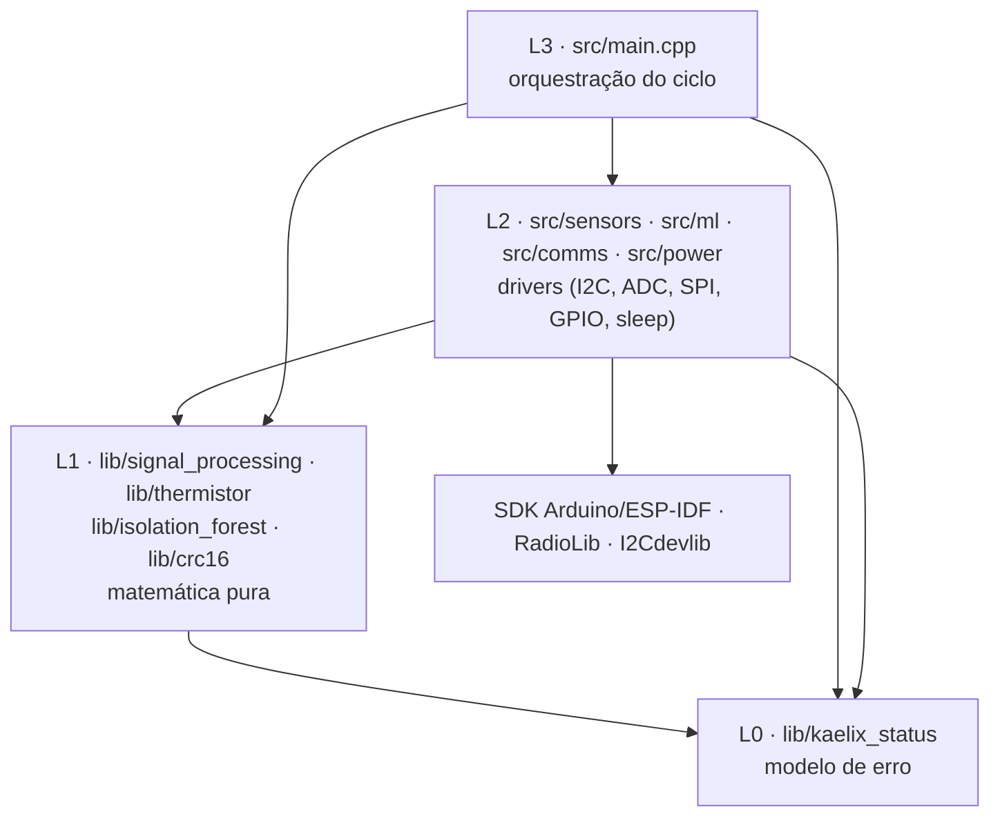

# Arquitetura de software do Kaelix

Documento normativo. Descreve as camadas do firmware, a regra de dependência
entre elas, as convenções de nome, a política de memória, a política de erro e
o estado seguro do dispositivo.

O alvo não é certificação DO-178C. O alvo é adotar — e conseguir justificar
numa defesa — as práticas de organização, determinismo e rastreabilidade que
projetos industriais e aeroespaciais usam, aplicadas a um dispositivo real:
ESP32-S3-WROOM-1 N16R8, MPU6050 no I2C, NTC 10k no ADC, SX1278 no SPI,
alimentado por LiPo com orçamento de ~346 µA médios e autonomia alvo de ~8
meses.

O ciclo do dispositivo é um superloop de um disparo:

```
acordar -> energizar periféricos (100 ms) -> 512 amostras a 1 kHz (0,512 s)
        -> 4 features -> Isolation Forest -> 20 bytes por LoRa (~150 ms)
        -> rádio em sleep -> cortar periféricos -> deep sleep (10 min)
```

Todo o trabalho acontece em `setup()`. `loop()` nunca executa. Isso não é um
detalhe de estilo: é a razão pela qual não existe escalonador, não existe fila,
não existe estado entre iterações, e a única memória que atravessa o ciclo é a
RTC memory. A arquitetura abaixo é desenhada para esse regime.

---

## 1. Camadas

Quatro camadas. A numeração é a ordem de dependência: `L(n)` pode depender de
`L(n-1)` e abaixo, nunca do contrário.

| Camada | Onde vive | O que é | Pode incluir | Compila no host? |
|---|---|---|---|---|
| **L0 — Contrato** | `lib/kaelix_status/` | Vocabulário de falha do projeto: `enum class Status`, `status_to_string`, macros de asserção | apenas `<cstdint>` e, em dev, `<cstdio>/<cstdlib>` | sim |
| **L1 — Matemática pura** | `lib/signal_processing/`, `lib/thermistor/`, `lib/isolation_forest/`, `lib/crc16/` | Funções determinísticas sem estado e sem I/O | L0 + `<cmath>`, `<cstdint>`, `<cstddef>` | sim (é o requisito) |
| **L2 — Drivers** | `src/sensors/`, `src/ml/`, `src/comms/`, `src/power/` | Tudo que toca hardware: I2C, ADC, SPI, GPIO, RTC memory, deep sleep | L0, L1, SDK (Arduino/ESP-IDF), bibliotecas de terceiros | não |
| **L3 — Orquestração** | `src/main.cpp` | A sequência do ciclo, a política de degradação e a entrada no estado seguro | L0, L1, L2, SDK | não |

Fora da pilha, mas parte do sistema:

| Componente | Onde | Relação |
|---|---|---|
| **Espelho de treino** | `training/kaelix_ml/features.py` | Reimplementa L1 em Python. Não é uma camada — é um **par verificado** (ver §7). |
| **Gerado** | `src/ml/isolation_forest_data.h` | Saída de `training/kaelix_ml/export_cpp.py`. Dado, não código. Nunca editado à mão. |
| **Testes** | `test/test_<mod>/` (host, Unity), `training/tests/` (pytest) | Dependem de tudo; nada depende deles. |



### A regra de dependência

1. **As setas só apontam para baixo.** `lib/` nunca inclui nada de `src/`.
   Nenhuma exceção: é essa proibição que mantém o ambiente `native` capaz de
   compilar e testar toda a matemática sem hardware.
2. **Camadas irmãs não se enxergam.** `src/comms/` não inclui `src/ml/`,
   `src/sensors/` não inclui `src/comms/`. Se dois módulos de L2 precisam do
   mesmo tipo, esse tipo desce para L0/L1 — onde ambos podem alcançá-lo sem
   se acoplarem.
3. **`#include "../outra_area/algo.h"` é proibido.** Um `../` que atravessa
   fronteira de área é sempre um sintoma da regra 2 sendo violada.
4. **Só L2 e L3 podem incluir `<Arduino.h>`, `esp_*.h` ou `driver/*.h`.**
5. **Só L3 decide o que o dispositivo faz com um erro.** L1 e L2 relatam.

> **Violação existente da regra 2 e 3.** `src/comms/lora.h:5` faz
> `#include "../ml/model.h"` para alcançar `kaelix::ml::Status`, e
> `LoraPacket::status` guarda esse enum. O resultado é que o formato de fio
> depende do módulo de inferência: mudar o enum de `ml` muda silenciosamente o
> significado de um byte no ar. A correção é mover o enum do fio para L0/L1 —
> um `kaelix::MachineState { Normal, Anomalous, Unknown }` compartilhado — e
> `ml` passa a produzi-lo em vez de defini-lo. (Arquivo sob posse de outro
> agente; registrado aqui como pendência, não alterado.)

### Como a regra é verificada, e não apenas escrita

Uma regra de arquitetura que não é executável é decoração. Três verificações,
todas rodáveis num comando:

- **`pio test -e native`** — o ambiente `native` compila `lib/` fora do
  toolchain do ESP32. Se qualquer arquivo de L0/L1 passar a incluir
  `<Arduino.h>`, a compilação quebra. A regra 1 é auto-imposta pela build.
- **Barreira de inclusão** (para `tools/check_layers.sh`, a ser criado):
  `grep -rn 'Arduino\.h\|esp_\|driver/\|<RadioLib' lib/` deve não retornar
  nada; `grep -rn '#include "\.\./' src/*/` deve não retornar nada.
- **`.clang-tidy`** com `misc-include-cleaner` e as convenções de §3 nas
  regras `readability-identifier-naming`.

---

## 2. Vale a pena uma camada HAL entre `src/` e o SDK?

A pergunta é legítima e a resposta padrão dos livros — "sim, sempre" — não é
obviamente certa aqui. Os dois lados, e depois a recomendação.

### A favor

- **Hoje `src/` é integralmente não testável.** Não há um único teste sobre
  `src/`. `vibration_read_features()` só roda com um MPU6050 no barramento; o
  que existe em `test/` cobre `lib/` e apenas `lib/`.
- **O defeito mais perigoso do firmware está em `src/`, não em `lib/`.**
  `src/main.cpp:33` registra que `vibration_init()` falhou e **segue mesmo
  assim** para `vibration_read_features()`, que hoje devolve as features de um
  buffer de zeros. RMS = 0, curtose = 0, fator de crista = 0 — um vetor que o
  Isolation Forest muito provavelmente classifica como `Normal`. O dispositivo
  transmite "máquina saudável" quando o que aconteceu foi "o sensor morreu".
  Essa é exatamente a classe de defeito que um teste com um duplê de I2C mudo
  pegaria em um segundo, e que nenhum teste de `lib/` jamais pegará.
- **A janela de 1 kHz é lógica, não só elétrica.** Manter 512 amostras a
  1 ms de intervalo, detectar jitter, detectar saturação de fundo de escala,
  detectar amostras congeladas — tudo isso é decisão de software que hoje não
  tem como ser exercitada sem hardware.
- **Um duplê permitiria alimentar o driver real com CSV do MAFAULDA**, e assim
  testar a cadeia inteira (aquisição -> features -> inferência -> pacote)
  contra um caso rotulado, e não só a matemática isolada.

### Contra

- **Uma HAL completa é cara para o que o projeto é.** I2C, SPI, ADC, GPIO,
  tempo e sleep: seis interfaces, duas implementações cada, mais o mecanismo
  de injeção. Ordem de 12 arquivos novos e algumas centenas de linhas — num
  firmware cujo `src/` inteiro tem menos de 200 linhas.
- **Não há polimorfismo real a extrair.** Existe um MPU6050, um NTC, um
  SX1278, uma instância de cada, escolhidos em tempo de compilação. Interfaces
  virtuais aqui pagam vtable e chamada indireta sem nunca haver um segundo
  implementador em produção.
- **Custo dentro da janela ativa.** A fase ativa é ~3 s a ~45 mA e responde
  por 94% da carga por ciclo. Indireção no laço de aquisição de 512 amostras é
  energia; não é dramática, mas é do lado errado do orçamento.
- **Custo de defesa.** Um TCC precisa que cada abstração seja justificável. Uma
  HAL introduzida "porque é boa prática", sem um teste que só exista por causa
  dela, é indireção que a banca vai — com razão — pedir para justificar.

### Recomendação: nem HAL completa, nem nada. Um único ponto de costura.

O ganho todo do argumento a favor vem de **um** lugar: separar *de onde vêm as
amostras* de *o que se faz com elas*. Isso não exige uma HAL; exige partir uma
função em duas.

```
src/sensors/vibration.cpp
    kaelix::Status vibration_acquire(float* dst, size_t n);       // toca I2C
    kaelix::Status vibration_features_from_samples(               // pura, testável
        const float* samples, size_t n, VibrationFeatures& out);
    kaelix::Status vibration_read_features(VibrationFeatures& out); // compõe as duas
```

`vibration_features_from_samples` não tem `Arduino.h`, roda no `native`, e é
onde mora a decisão perigosa: sensor ausente, amostras saturadas, amostras
congeladas, taxa não sustentada — todas viram `Status`, e nenhuma delas produz
um vetor de features que o modelo possa ler como `Normal`. `vibration_acquire`
continua sem teste, e tudo bem: ela é um laço de leitura I2C, trivial de
inspecionar, e é a parte cujo teste exigiria o duplê caro.

Custo: um arquivo, três funções, zero indireção em tempo de execução, zero
vtable. Ganho: o defeito mais perigoso do firmware passa a ter um teste.

**Se mais tarde uma HAL de verdade for desejável** (por exemplo, se um segundo
sensor entrar no projeto), a recomendação é fazê-la por *costura de
compilação* — um `src/hal/hal_esp32.cpp` no ambiente `esp32-s3` e um
`test/hal_fake.cpp` no `native`, mesma assinatura, escolhidos pelo link — e
não por interfaces virtuais. Mesma testabilidade, custo de execução zero.

---

## 3. Convenções

Uniformes em `lib/`, `src/`, `test/`. A análise estática deve reforçá-las.

| Elemento | Convenção | Exemplo no Kaelix |
|---|---|---|
| Diretório de módulo `lib/` | `snake_case`, nome do módulo | `lib/signal_processing/` |
| Arquivo | `snake_case`, mesmo nome do módulo, `.h`/`.cpp` | `signal_processing.h` / `.cpp` |
| Arquivo gerado | sufixo `_data.h` + cabeçalho "GERADO POR … NÃO EDITAR" | `isolation_forest_data.h` |
| Namespace | `kaelix::<area>`; `kaelix` puro só para L0; `kaelix::detail` para implementação | `kaelix::sensors`, `kaelix::comms`, `kaelix::detail` |
| Tipo (struct, class, enum) | `PascalCase` | `VibrationFeatures`, `IsolationTree`, `LoraPacket`, `Status` |
| Enumerador | `PascalCase`, sempre `enum class` | `Status::SensorAbsent` |
| Função | `snake_case`, verbo primeiro | `compute_rms`, `lora_send`, `deep_sleep` |
| Função exportada de L2 | prefixada pelo módulo | `vibration_init`, `temperature_read_celsius` |
| Variável e parâmetro | `snake_case` | `sample_rate_hz`, `n_samples` |
| Membro de struct | `snake_case`, sem prefixo nem sufixo | `dominant_freq_hz` |
| Constante `constexpr` | `UPPER_SNAKE_CASE` | `DOMINANT_BAND_LO_HZ`, `PACKET_VERSION` |
| Macro | `KAELIX_` + `UPPER_SNAKE_CASE` | `KAELIX_REQUIRE` |
| Macro privada de header | mesma regra, sufixo `_` | `KAELIX_ASSERT_FAIL_` |
| Arquivo de teste | `test/test_<mod>/test_<mod>.cpp` | `test/test_crc16/test_crc16.cpp` |
| Caso de teste | `test_<função>_<condição>_<esperado>` | `test_rms_of_sine_wave` |

**Regra de unidade no nome — obrigatória.** Toda grandeza física carrega a
unidade como sufixo: `_hz`, `_ms`, `_us`, `_mv`, `_ohm`, `_c`, `_dbm`, `_ua`,
`_mah`. Um `float temperature` é proibido; `float temperature_c` é obrigatório.
Custo zero, e elimina por construção a classe de erro mais cara que existe em
software embarcado — a que confunde uma unidade com outra em uma conversão.
O código atual já segue isso em `sample_rate_hz`, `r_fixed_ohm`, `vcc_mv`; a
regra apenas o torna inegociável.

**Macros só onde função não serve.** Uma macro é aceitável quando precisa de
`__FILE__`/`__LINE__` ou de um `return` no escopo do chamador — isto é, para o
que está em `kaelix_status.h` e nada mais. Constantes são `constexpr`, nunca
`#define`. Ver JSF++ AV-29/AV-31 pelo mesmo motivo.

**Ordem de inclusão** em cada `.cpp`: o próprio header do módulo, linha em
branco, headers do projeto (`kaelix_status.h`, L1), linha em branco, headers do
SDK/terceiros, linha em branco, headers da biblioteca padrão.

---

## 4. Política de memória

### A regra

**Nenhuma alocação dinâmica depois da inicialização.** No Kaelix, na prática,
isso significa **nenhuma alocação dinâmica, ponto** — porque o dispositivo não
tem fase de inicialização longa: ele acorda, trabalha 3 s e dorme, 144 vezes
por dia, por 8 meses. Um `malloc` por ciclo é ~35 000 alocações e liberações no
mesmo heap ao longo da vida útil, sem nenhum recurso para diagnosticar
fragmentação em campo. (JSF++ AV-206; MISRA C++ 18-4-1; DO-178C, determinismo
de memória.)

Proibidos em L1, L2 e L3 após a inicialização: `new`, `delete`, `malloc`,
`free`, `std::vector`, `std::string`, `std::function`, e qualquer container que
aloque. Permitidos: `std::array`, ponteiro cru com tamanho explícito,
`constexpr`, buffers de escopo de arquivo.

**Violações atuais** (arquivos sob posse de outros agentes; listadas aqui para
que o refactor tenha destino definido):

| Local | O que aloca | Destino |
|---|---|---|
| `lib/signal_processing/signal_processing.cpp:92-93` | dois `std::vector<float>` de `n` por chamada de `dominant_frequency()` — 4 KB por ciclo | buffers estáticos de escopo de arquivo (abaixo) |
| `src/sensors/vibration.cpp:21` | `std::vector<float>` de `n_samples` por chamada | buffer estático de amostras (abaixo) |
| `src/comms/lora.cpp:17` | `new Module(...)` em inicialização estática | **evitável**: `static Module lora_module(CS, DIO0, RST); static SX1278 radio(&lora_module);` — a API do RadioLib aceita um `Module*` já existente, então o `new` não é imposto pela biblioteca. Se alguma versão exigir, vira o desvio DEV-001 do §8. |

### Onde ficam os buffers e como os tamanhos são derivados

Uma única constante de configuração governa toda a cadeia de vibração:

```
KAELIX_VIBRATION_SAMPLES = 512      // amostras por ciclo, potência de 2 (FFT radix-2)
KAELIX_SAMPLE_RATE_HZ    = 1000     // taxa alvo do MPU6050
```

Delas decorrem, e **nada é dimensionado por número solto**:

| Buffer | Fórmula | Bytes | Onde |
|---|---|---|---|
| Amostras do acelerômetro | `float[KAELIX_VIBRATION_SAMPLES]` | 2 048 | escopo de arquivo em `src/sensors/vibration.cpp` |
| Parte real da FFT | `float[KAELIX_FFT_MAX_N]`, `KAELIX_FFT_MAX_N = KAELIX_VIBRATION_SAMPLES` | 2 048 | escopo de arquivo em `lib/signal_processing/signal_processing.cpp` |
| Parte imaginária da FFT | idem | 2 048 | idem |
| Vetor de features | `float[N_FEATURES]`, `N_FEATURES = 4` | 16 | pilha de `model_infer` |
| Pacote LoRa | `sizeof(LoraPacket)` | 20 | pilha de `setup()` |
| Estado que atravessa o sleep | `boot_count`, causa do último reset, último status | ~12 | `RTC_DATA_ATTR` |
| **Total estático do Kaelix** | | **≈ 6,2 KB** | de 512 KB de SRAM interna |

Consequências que decorrem diretamente da tabela, e não de preferência:

- **`n` precisa ser validado, não presumido.** Com buffer estático,
  `n > KAELIX_FFT_MAX_N` deixa de ser "aloca mais" e passa a ser estouro de
  buffer. Por isso `dominant_frequency` valida com
  `KAELIX_REQUIRE_VALUE(n <= KAELIX_FFT_MAX_N, Status::LengthOutOfRange, 0.0f)`
  e `KAELIX_REQUIRE_VALUE((n & (n - 1)) == 0, Status::LengthNotPowerOfTwo, 0.0f)`.
  A segunda checagem não existe hoje e é grave: a FFT radix-2 com `n` não
  potência de 2 não falha — ela devolve um espectro errado, silenciosamente, e
  a feature `dominant_freq_hz` diverge do treino sem que nada acuse.
- **A assinatura de L1 não muda.** As funções de `lib/signal_processing`
  continuam devolvendo `float` (ver §5 e §7). O buffer estático é detalhe de
  implementação; para todo `n` válido o resultado é bit a bit o de hoje.
- **O modelo mora em flash, não em RAM.** As árvores exportadas são
  `const`/`constexpr` e ficam em `.rodata`. Custo por nó: 2 (`feature`) + 4
  (`threshold`) + 2 (`left`) + 2 (`right`) + 4 (`leaf_correction`) = 14 B. Com
  `SUBSAMPLE_SIZE = 256`, uma árvore tem no máximo 511 nós — logo ~7,2 KB por
  árvore, ~715 KB para 100 árvores. Cabe folgado nos 16 MB de flash, mas é o
  número que deve governar a escolha de `n_estimators` no treino, e ele
  pertence a este documento justamente porque é uma decisão de arquitetura
  disfarçada de hiperparâmetro.
- **A PSRAM de 8 MB não tem uso.** `platformio.ini` declara
  `-D BOARD_HAS_PSRAM` e `memory_type = qio_opi`, mas a política de memória
  acima usa ~6 KB dos 512 KB internos. PSRAM octal habilitada custa
  inicialização e corrente na janela ativa em troca de memória que o projeto
  decidiu não usar. Recomenda-se medir com e sem o flag na Fase 3 e, se a
  diferença aparecer no orçamento de 346 µA, removê-lo.
- **Recursão é proibida** (JSF++ AV-119): sem recursão, o pico de pilha é
  estático e analisável. A travessia da árvore do Isolation Forest já é
  iterativa; deve continuar.
- **Todo laço tem cota superior provável.** Laços sobre `n` amostras ou `n`
  bins são limitados pela constante de configuração. O laço cujo limite vem de
  *dado externo* — `while (tree.feature[node] != -1)` em
  `lib/isolation_forest/isolation_forest.cpp:17` — não tem cota e precisa de
  uma: `KAELIX_MAX_TREE_DEPTH` (derivada de `SUBSAMPLE_SIZE`, com folga), e ao
  estourar devolve `Status::ModelDepthExceeded`. Regra geral: *laço cujo limite
  venha de barramento, modelo ou pacote precisa de cota constante e de um
  status para quando ela estourar.*

---

## 5. Política de erro

### O vocabulário

`lib/kaelix_status/kaelix_status.h` (L0) define `enum class Status : uint8_t`,
com 0 = sucesso e faixas por subsistema (`0x1_` vibração, `0x2_` temperatura,
`0x3_` modelo, `0x4_` rádio, `0x5_` plataforma). Vive em `lib/` para que L1 e
L2 usem o mesmo vocabulário sem que `lib/` passe a depender de `src/`.

O `bool` de hoje é insuficiente por um motivo operacional concreto: as seis
funções que retornam `bool` no firmware devolvem todas o mesmo `false`, e
"rádio LoRa não inicializou" pode ser antena solta, SPI mudo, chip ausente ou
frequência recusada — quatro deslocamentos de manutenção diferentes.
`RF_ABSENT`, `SPI_SILENT`, `RF_CFG_REJ` e `TX_FAIL` são quatro respostas
diferentes para o técnico.

### Quem faz o quê

| Camada | Responsabilidade |
|---|---|
| **L1 (`lib/`)** | Valida os próprios parâmetros com `KAELIX_REQUIRE*`. Não loga, não decide, não conhece o dispositivo. As funções de matemática mantêm o retorno `float` (§7) e usam `KAELIX_REQUIRE_VALUE` com o mesmo valor de guarda que já devolvem hoje. |
| **L2 (`src/`)** | Traduz o erro do hardware/SDK para `Status` **o mais próximo possível da causa**: um `RADIOLIB_ERR_CHIP_NOT_FOUND` vira `RadioAbsent`, um `RADIOLIB_ERR_INVALID_FREQUENCY` vira `RadioConfigRejected`. Propaga com `KAELIX_CHECK`. Não decide o destino do ciclo e não entra em sleep. |
| **L3 (`main.cpp`)** | Único ponto que **decide**: o que degrada, o que aborta, o que é logado, o que vai no pacote e quando se entra no estado seguro. |

**Ninguém engole erro.** Um `Status` retornado e ignorado é defeito de revisão.
As funções que retornam `Status` devem ser marcadas `[[nodiscard]]` para que o
compilador cobre isso — hoje `main.cpp:61` chama `comms::lora_sleep()` e
descarta o retorno, e é o descarte mais caro do firmware: se o rádio não
adormecer, ele passa 10 minutos em standby a 1,5 mA, 910 mA·s por ciclo,
5,5× o orçamento inteiro do dispositivo, e ninguém fica sabendo.
`Status::RadioSleepFailed` existe exatamente para esse caso.

### Degradação: o que o ciclo faz com cada falha

O ciclo **não aborta no primeiro erro**. Ele degrada e segue, porque o pacote
de diagnóstico vale mais que a interrupção. `status_first_error()` acumula a
causa raiz sem deixar que um erro derivado a sobrescreva.

| Falha | O ciclo continua? | O que é transmitido |
|---|---|---|
| `SensorAbsent`, `BusSilent`, `SampleRateMissed`, `SensorSaturated`, `SensorStuck` | sim | estado da máquina = **Desconhecido**, nunca `Normal`; diagnóstico = o status |
| `ThermistorOpen/Shorted`, `TemperatureImplausible` | sim | vibração e inferência normais; `temperature_c` = sentinela (NaN); diagnóstico = o status |
| `ModelAbsent`, `ModelMalformed`, `ModelDepthExceeded`, `ScoreNotFinite` | sim | estado = **Desconhecido**; diagnóstico = o status |
| `RadioAbsent`, `RadioBusSilent`, `RadioConfigRejected` | sim, sem transmitir | nada — segue direto para o estado seguro (§6) |
| `RadioTxFailed`, `RadioTxTimeout` | uma retentativa, depois desiste | o gateway percebe pela lacuna em `boot_count` |
| `RadioSleepFailed` | uma retentativa; se persistir, `radio.reset()` e nova tentativa | registrado em RTC memory e transmitido no ciclo seguinte |
| Contrato (`0x01..0x0F`) em produção | sim, degradado | diagnóstico = o status: é bug de firmware chegando ao gateway em vez de morrer em silêncio |

**O invariante que governa a tabela inteira: nunca transmitir um `Normal`
fabricado.** Um pacote perdido é um buraco visível no `boot_count` do gateway;
um pacote dizendo "máquina saudável" quando o acelerômetro está morto é uma
mentira que ninguém detecta. Silêncio é mais seguro que falso negativo. É por
isso que `kaelix::ml::Status` precisa de um terceiro valor (`Unknown`) e o
pacote precisa de um byte de diagnóstico — `PACKET_VERSION` sobe para 2, o
pacote passa de 20 para 21 bytes, o tempo no ar cresce em ~1% e o gateway
passa a receber a causa junto com o veredito. (Arquivos sob posse de outros
agentes; registrado como pendência.)

### Asserção: desenvolvimento aborta, produção não

`KAELIX_REQUIRE(cond, status)`, `KAELIX_REQUIRE_VALUE(cond, status, fallback)`,
`KAELIX_REQUIRE_VOID(cond, status)`, `KAELIX_ENSURE(cond, status)` e
`KAELIX_CHECK(expr)`.

- **Desenvolvimento** (padrão — `pio test -e native`, bancada): imprime
  `arquivo:linha (condição) -> STATUS` em `stderr` e chama `abort()`. Um
  contrato violado é um bug nosso, e o pior desfecho possível é ele devolver um
  número plausível: um teste que recebe `0.0f` e passa esconde exatamente a
  classe de falha silenciosa que a paridade numérica não detecta.
- **Produção** (`-D KAELIX_PRODUCTION` no ambiente `esp32-s3`): **não aborta**.
  Devolve o status e o ciclo continua degradado até transmitir o diagnóstico e
  entrar no estado seguro. O dispositivo passa 8 meses numa máquina sem ninguém
  por perto: abortar transforma um bug num aparelho morto e mudo; retornar
  transforma o mesmo bug num pacote com `MODEL_BAD` chegando ao gateway. Em
  campo, a disponibilidade do caminho de diagnóstico vale mais que fail-fast.
  Em produção nem `<cstdio>` é incluído — nenhum literal `__FILE__` vai para a
  flash e nenhum `fprintf` é linkado (verificado com `clang++ -H`).

Essa assimetria é deliberada e é o ponto em que o Kaelix se afasta do
`assert()` da biblioteca padrão, que não oferece o meio-termo.

### O que é logado

O log serial existe para bancada e Fase 3, não para operação: em campo não há
ninguém com um cabo USB, e o `Serial` custa energia na janela ativa. Formato
fixo, uma linha por fase, sem texto livre:

```
[kaelix] <fase> <STATUS>            ex.:  [kaelix] radio RF_ABSENT
[kaelix] cycle <STATUS> boot=<n>    linha final, sempre emitida
```

A string vem de `status_to_string()` — literal em `.rodata`, sem formatação,
sem alocação, no máximo 12 caracteres. O log é gatilhado por
`-D KAELIX_LOG_SERIAL` e some da build de produção; o canal de diagnóstico de
produção é o byte de status no pacote LoRa, não o UART.

---

## 6. Estado seguro

### Definição

O **Estado Seguro do Kaelix (ESK)** é:

1. SX1278 em `SLEEP` (~0,2 µA), confirmado pelo retorno de `lora_sleep()`;
2. trilha dos periféricos cortada pelos BC337, com `gpio_hold_en()` +
   `gpio_deep_sleep_hold_en()` aplicados (sem o hold, a base flutua durante os
   10 minutos em que o corte precisa valer);
3. deep sleep com wakeup por timer armado;
4. nenhum pacote com veredito fabricado emitido neste ciclo.

Repare que o estado seguro **não** é "desligado". Um dispositivo que se desliga
para de monitorar a máquina — e a máquina continua girando. Estado seguro aqui
é *quieto, de baixíssimo consumo e reagendado*: ele preserva a bateria, preserva
a capacidade de tentar de novo em 10 minutos, e não mente enquanto isso.

### O que leva a ele

| Gatilho | Caminho |
|---|---|
| Fim normal do ciclo | ESK com o período nominal de 10 min |
| Rádio ausente ou mudo (`0x40`, `0x41`, `0x42`) | ESK imediato, sem tentar transmitir |
| Qualquer status fatal após a tentativa de TX | ESK com o período nominal |
| `CycleDeadlineExceeded` | ESK imediato; a fase ativa é cortada onde estiver |
| `SupplyVoltageLow` | ESK com período **estendido** (ex.: 60 min): abaixo do mínimo de TX, insistir só gasta a bateria que resta |
| Watchdog dispara | reset do MCU; o novo boot registra `WatchdogResetDetected` em RTC memory e termina o ciclo em ESK |
| Brownout | reset do MCU; idem, com `BrownoutResetDetected` |

### Watchdog

Hoje não há nenhum. Se `setup()` travar — laço da árvore sem cota, transação
I2C sem timeout, `radio.transmit()` bloqueado — o dispositivo fica acordado a
~45 mA e esvazia a LiPo de 2000 mAh em cerca de dois dias, e depois fica morto
até alguém ir até a máquina. Não há como o gateway distinguir isso de um
dispositivo fora de alcance.

Política:

- **Task WDT habilitado no primeiro instante de `setup()`**, antes de energizar
  qualquer periférico, com pânico ativado (reset).
- **Timeout = 8 s.** A fase ativa nominal é ~3,15 s (100 ms de estabilização +
  512 ms de aquisição + processamento + ~150 ms de TX); 8 s dá mais de 2× de
  margem sem chegar perto de custar energia relevante se disparar.
- **`KAELIX_CYCLE_DEADLINE_MS = 5000`** como cota de software, verificada nos
  pontos de junção do ciclo. É a rede que pega o atraso *antes* do watchdog:
  ao estourar, o ciclo devolve `CycleDeadlineExceeded` e vai para o ESK de
  forma ordenada — com o rádio adormecido —, enquanto o watchdog reseta com o
  rádio no estado em que estiver.
- **O watchdog não é alimentado dentro de laços de espera de hardware.**
  Alimentar o WDT enquanto se espera por um barramento derrota o propósito
  dele; cada espera de hardware tem seu próprio timeout e seu próprio status
  (`BusTimeout`, `RadioTxTimeout`).
- **`esp_reset_reason()` é lido no início de todo boot** e o motivo entra na
  RTC memory e no próximo pacote. Um dispositivo que reinicia por watchdog a
  cada ciclo precisa ser visível do escritório, não do chão de fábrica.

**Invariante de tempo do dispositivo:** *o Kaelix nunca fica acordado por mais
de 8 s consecutivos.* Quem garante é o watchdog; quem faz isso acontecer de
forma ordenada é a cota de 5 s.

---

## 7. O invariante inegociável: paridade numérica

`lib/signal_processing/` e `training/kaelix_ml/features.py` implementam a mesma
matemática dos dois lados. A paridade está verificada em 15 casos:
`dominant_freq_hz` bate exatamente, as demais features divergem no máximo
5,1e-06. `lib/isolation_forest/` é validado contra `sklearn.score_samples` com
tolerância 1e-4 em `training/tests/test_export_cpp.py`.

Se um refactor mudar qualquer valor calculado, o modelo treinado deixa de
corresponder ao que o dispositivo mede — e a falha é **silenciosa**: não aparece
na compilação, não aparece em teste de tipo, e o dispositivo continua
transmitindo vereditos com aparência normal.

Isso restringe a arquitetura de forma concreta:

1. **As funções de L1 não mudam de assinatura.** Elas continuam devolvendo
   `float`. É por isso que `kaelix_status.h` traz `KAELIX_REQUIRE_VALUE` em vez
   de exigir que tudo retorne `Status`: a validação entra sem tocar no contrato
   numérico. O `fallback` de cada asserção deve ser **exatamente** o valor que a
   função já devolve hoje naquele caso (`0.0f` nas guardas existentes).
2. **Toda mudança em `lib/` roda os testes antes e depois** — `pio test -e
   native` (26 testes) e `pytest` em `training/tests/`. Sem exceção, inclusive
   para mudanças "só de organização": trocar `std::vector` por buffer estático
   não deveria mudar nenhum bit, e é justamente por isso que precisa ser
   demonstrado, e não presumido.
3. **A ordem das features é contrato.** `src/ml/model.cpp:16-21` monta
   `{rms, kurtosis, crest_factor, dominant_freq_hz}` e
   `training/kaelix_ml/features.py:105` declara a mesma ordem em
   `FEATURE_ORDER`. Nada hoje impede que uma mude sem a outra — e o efeito é um
   modelo lendo curtose no lugar de RMS, sem erro em lugar nenhum.
   `export_cpp.py` deve emitir a ordem como dado no header gerado, e
   `model.cpp` deve conferi-la com `static_assert` (`ModelFeatureMismatch`
   existe para o caso em tempo de execução).
4. **`isolation_forest_data.h` é gerado, nunca editado.** Editá-lo à mão quebra
   a correspondência com o modelo treinado sem deixar rastro no pipeline.

---

## 8. Registro de desvios

Um desvio é uma regra deste documento que um trecho de código não cumpre,
com justificativa aceita e revisão marcada. Desvio registrado é engenharia;
desvio não registrado é dívida.

| ID | Regra | Onde | Justificativa | Revisão |
|---|---|---|---|---|
| DEV-001 | Sem alocação dinâmica | `src/comms/lora.cpp:17`, `new Module(...)` | **Evitável** — `static Module lora_module(...); static SX1278 radio(&lora_module);` remove o `new`. O desvio só se aplica se alguma versão do RadioLib exigir o ponteiro alocado; nesse caso é uma alocação única, em inicialização estática, nunca liberada, de tamanho fixo, sem possibilidade de fragmentação porque nada mais aloca. | Fase 3 |
| DEV-002 | L2 sem teste | `src/sensors/vibration.cpp` (`vibration_acquire`) | Testá-la exigiria o duplê de I2C que §2 recomenda não construir. Mitigado por manter a função reduzida a um laço de leitura, com toda a decisão em `vibration_features_from_samples`, que é testada. | quando houver segundo sensor |
| DEV-003 | `float` é proibido em comparação de igualdade | `signal_processing.cpp:33,39` (`m2 == 0.0`, `rms == 0.0f`) | Comparação contra zero exato é a guarda de divisão correta aqui, e é **idêntica** à do Python (`features.py:30,38`). Mudar para tolerância quebraria a paridade. | não revisar — é intencional |

---

## 9. Rastreabilidade

Sem uma linha ligando requisito, código e teste, não há como afirmar numa
defesa que o sistema faz o que foi pedido — só que ele passa nos testes que
alguém lembrou de escrever.

Convenção: cada requisito recebe um ID `REQ-<ÁREA>-<NNN>`, aparece como
comentário `// REQ-VIB-002` na função que o implementa e no caso de teste que o
verifica, e a tabela abaixo é a única fonte da ligação. Um requisito sem teste
é uma lacuna visível; um teste sem requisito é um teste que ninguém sabe por
que existe.

Semente da matriz, com o que já existe hoje:

| ID | Requisito | Código | Teste | Estado |
|---|---|---|---|---|
| REQ-VIB-001 | Extrair RMS, curtose, fator de crista e frequência dominante de 512 amostras a 1 kHz | `lib/signal_processing/` | `test/test_signal_processing/` | verificado |
| REQ-VIB-002 | Frequência dominante do espectro de **velocidade**, banda 10–1000 Hz (ISO 10816-3) | `signal_processing.cpp:88` | `test_signal_processing` + `training/tests/test_features.py` | verificado |
| REQ-VIB-003 | Sensor ausente ou mudo **nunca** produz veredito `Normal` | `src/sensors/vibration.cpp`, `src/main.cpp` | — | **lacuna** |
| REQ-TMP-001 | Converter mV do ADC em °C pela equação B (NTC 10k, beta 3950) | `lib/thermistor/` | `test/test_thermistor/` | verificado |
| REQ-TMP-002 | NTC aberto ou em curto é detectado e não vira temperatura plausível | `src/sensors/temperature.cpp` | — | **lacuna** |
| REQ-ML-001 | Score do Isolation Forest embarcado equivale ao do sklearn (tol. 1e-4) | `lib/isolation_forest/` | `training/tests/test_export_cpp.py` | verificado |
| REQ-ML-002 | Travessia da árvore tem cota de profundidade provável | `isolation_forest.cpp:17` | — | **lacuna** |
| REQ-COM-001 | Pacote protegido por CRC-16/CCITT-FALSE | `lib/crc16/`, `src/comms/lora.cpp` | `test/test_crc16/` | verificado |
| REQ-COM-002 | Formato do pacote é versionado | `lora.h:12,33` | — | **lacuna** |
| REQ-PWR-001 | Rádio em sleep antes do deep sleep (orçamento de 346 µA) | `src/comms/lora.cpp:58`, `main.cpp:61` | — | **lacuna** (e o retorno é descartado) |
| REQ-PWR-002 | Dispositivo nunca acordado por mais de 8 s consecutivos | — | — | **não implementado** |
| REQ-SYS-001 | Nenhuma alocação dinâmica após inicialização | `lib/`, `src/` | análise estática | **em violação** (§4) |
| REQ-SYS-002 | Toda falha carrega causa diagnosticável até o gateway | `lib/kaelix_status/` | — | parcial (L0 pronto) |

---

## 10. Resumo das pendências que este documento cria

Nenhum arquivo além de `lib/kaelix_status/kaelix_status.h` e deste documento foi
alterado. As pendências abaixo têm destino definido acima e pertencem a quem
detém cada arquivo:

1. `dominant_frequency`: buffers estáticos + validação de `n` (potência de 2,
   `<= KAELIX_FFT_MAX_N`, ponteiro não nulo) — §4.
2. `isolation_tree_path_length`: cota `KAELIX_MAX_TREE_DEPTH` e validação de
   índice de nó; `isolation_forest_score` com `n_trees <= 0` hoje divide por
   zero e produz NaN, que a comparação `score > threshold` transforma
   silenciosamente em `Normal` — §4, §5.
3. `vibration_read_features`: partir em aquisição + features; falha de
   inicialização não pode virar buffer de zeros — §2, §5.
4. `temperature_read_celsius`: sem canal de erro; NTC aberto vira ~-50 °C
   plausível. `ntc_resistance_to_celsius` com resistência ≤ 0 devolve NaN sem
   guarda — §5.
5. `lora.cpp`: trocar `new Module` por instância estática; traduzir os códigos
   do RadioLib em `Status` específicos — §4, §5.
6. `main.cpp`: `[[nodiscard]]` nos retornos, conferir `lora_sleep()`, acumular
   com `status_first_error`, habilitar o watchdog, ler `esp_reset_reason()` — §5, §6.
7. `lora.h`: remover `#include "../ml/model.h"`; `PACKET_VERSION = 2` com byte
   de diagnóstico e estado `Unknown`; `static_assert` no offset do CRC — §1, §5.
8. `platformio.ini`: `-D KAELIX_PRODUCTION` no ambiente `esp32-s3` (e **não**
   no `native`); avaliar a remoção de `-D BOARD_HAS_PSRAM` — §4, §5.
