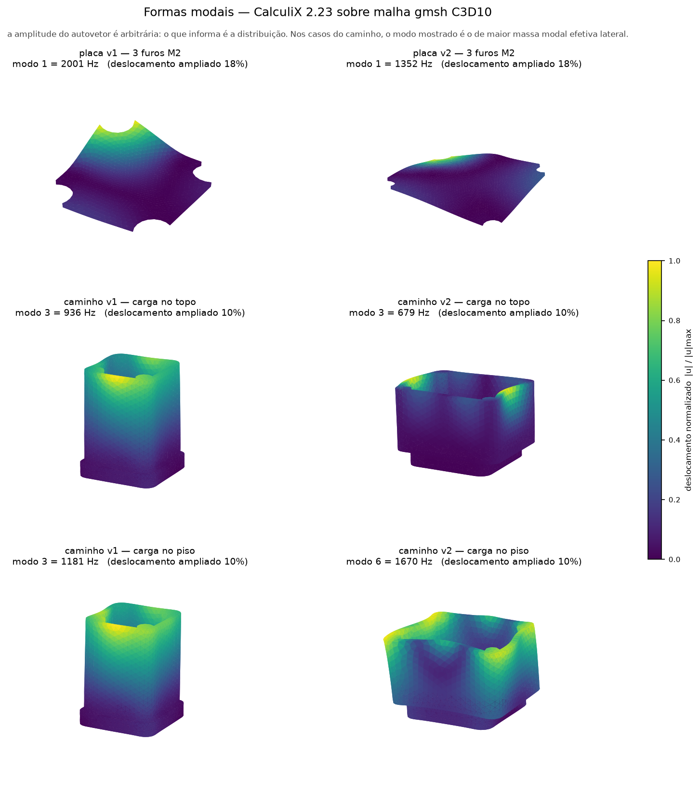
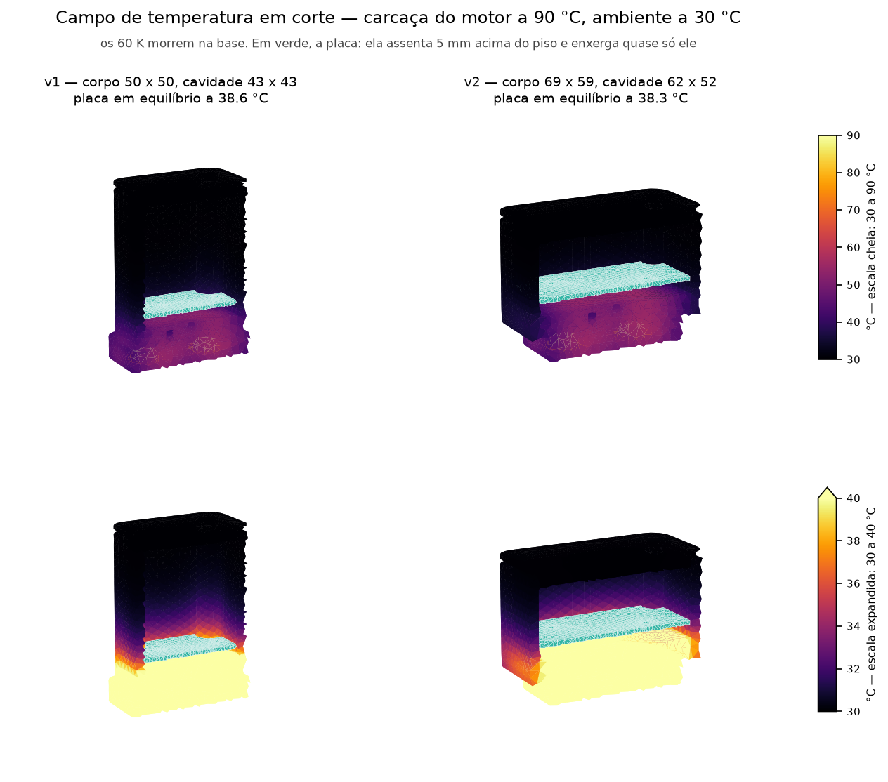

# Análise modal — placa e caminho de montagem

Elementos finitos com gmsh 4.15 (malha) e CalculiX 2.23 (solver), ambos os
binários vindos da instalação do FreeCAD. Nada aqui é editado à mão; todo o
conteúdo de `v1/` e `v2/` é derivado e está no `.gitignore` (uma rodada
completa passa de 200 MB).

```
# sólido do caminho de rigidez (base + corpo unidos pelo spigot)
/Applications/FreeCAD.app/Contents/Resources/bin/freecadcmd hardware/fem_caminho.py

# modo próprio da placa, por versão
KAELIX_PCB=v1 uv run --no-project --with gmsh python hardware/fem_modal.py
KAELIX_PCB=v2 uv run --no-project --with gmsh python hardware/fem_modal.py

# modo do caminho de montagem, as duas versões numa rodada
uv run --no-project --with gmsh python hardware/fem_montagem.py
KAELIX_MALHA=1.8 uv run --no-project --with gmsh python hardware/fem_montagem.py
```

## Por que existe

`experiments/notebooks/analise-involucro.ipynb` testou três hipóteses e
confirmou uma: o caminho **motor → ímãs → base ASA → spigot → corpo ASA → PCB
→ MPU6050** tem frequência de montagem dentro dos 10–1000 Hz que a
ISO 10816-3 exige, estimada em **560 Hz**. Aquela análise é de mola
equivalente, e trata a placa como massa rígida.

Ficaram duas lacunas, e as duas passaram a ser resolvíveis quando os sólidos
do invólucro e da placa passaram a existir:

1. A placa também é uma mola. Um acelerômetro no ponto mais flexível de uma
   chapa de 1,6 mm mede a flexão da chapa.
2. Existem duas versões de invólucro para comparar. A estimativa por mola
   equivalente usa uma massa fixa de 118 g e não distingue as duas.

## Resultado 1 — modo próprio da placa

Contorno e furos lidos do `.kicad_pcb` gerado, não redigitados. FR-4
isotrópico, E = 24 GPa, ν = 0,136, ρ = 1850 kg/m³, 1,6 mm. Massa dos
componentes somada como densidade equivalente (+5,1 g).

| apoio | v1 42 × 42 | v2 61 × 51 |
|---|---|---|
| 3 furos M2 engastados, chapa nua | 2951 Hz | 1702 Hz |
| 3 furos M2 engastados, povoada | **2001 Hz** | **1352 Hz** |
| aro com apoio simples, povoada | 3986 Hz | 2398 Hz |

Aumentar a placa custou **32%** do primeiro modo. O limite inferior continua
acima dos 1000 Hz da ISO nas duas versões — a decisão de ir para 61 × 51 não
introduz modo na banda.

Consequência de amostragem, essa sim aberta: com fs = 1000 Hz, um modo em
1352 Hz **dobra para 352 Hz** e fica indistinguível de vibração real. O
`vibration_init` já registra a configuração do DLPF como pendência decisiva e
devolve `NotImplemented`; o modo próprio da placa é mais um item que esse
filtro tem de rejeitar.

## Resultado 2 — modo do caminho de montagem

Base + corpo unidos pelo spigot, ASA maciço isotrópico E = 2,0 GPa,
ν = 0,35, ρ = 1070 kg/m³. Engaste nos quatro bolsos de ímã. Tampa sempre
como massa na borda de cima. O modo relatado é o de **maior massa modal
efetiva lateral**, não o primeiro autovalor: em vários casos o primeiro modo é
local de parede e não move o sensor.

| carga placa+bateria | v1 (19,4 g + tampa 13,8) | v2 (48,8 g + tampa 23,8) |
|---|---|---|
| no piso da cavidade | 1181 Hz | 1670 Hz |
| na borda de cima do corpo | **936 Hz** | **679 Hz** |
| massa modal efetiva | 57–69 g de ~110 g | 41–43 g de ~135 g |

**A v2 não resolve o caminho, e na hipótese pessimista piora.** O corpo é
24 mm mais baixo e mais rígido, e mesmo assim a frequência cai: a célula de
2000 mAh que entrega os 265 dias de REQ-PWR-06 põe 25 g a mais sobre a mola de
ASA, e a massa vence a geometria.

Contra a estimativa do notebook: os 560 Hz correspondem ao caso pessimista, e
o modelo os reproduz de perto — o menor autovalor da v2 com carga no topo é
530 Hz. O que a estimativa não conseguia mostrar é que **a posição da carga
vale um fator 2,5 na frequência**, e o projeto não a define.

A regra prática de f_n ≥ 3 × f_max continua **não atendida** em nenhum dos
quatro casos: pede 1500 Hz para a banda de 500 Hz do MPU6050 e 3000 Hz para os
1000 Hz da ISO. Só a v2 com carga no piso passa do primeiro critério. A
recomendação de base metálica do notebook permanece de pé.

## Formas modais



```
uv run --no-project --with numpy --with matplotlib python hardware/fem_figuras.py
```

O que as formas mostram, e que os números sozinhos não diziam:

- **placa v1 e v2** — flexão simples, com os três furos M2 como os únicos
  pontos parados. O ventre cai na região dos recortes de canto, não no centro:
  o triedro assimétrico da v1 (97°) põe o máximo perto de um recorte
- **caminho v1** — flexão de viga engastada limpa: o deslocamento cresce
  monotonicamente com a altura e é máximo na borda de cima. É exatamente o
  modelo que `analise-involucro.ipynb` assumiu
- **caminho v2** — **não** é flexão de viga. A base fica praticamente parada e
  o deslocamento se concentra na borda superior, em dois cantos opostos. Baixar
  o corpo de 62 para 38 mm enrijeceu a coluna, mas alargou os painéis de
  50 × 50 para 69 × 59 — a flexibilidade mudou de lugar, do balanço da coluna
  para a borda da caixa aberta

Essa troca é a razão de a v2 não herdar a melhora que a altura menor sugeriria.

## Resultado 3 — vibração aleatória e fadiga de junta (Steinberg)

`hardware/vibracao.py`, figura em `experiments/figures/scripts/fig10_vibracao.R`.

Excitação da própria norma que o produto usa: ISO 10816-3 classe III, limiar
C/D = 11,2 mm/s RMS, com os limites importados de
`training/kaelix_ml/labeling.py`. Densidade espectral de **velocidade**
constante na banda de 10–1000 Hz — é o que vibração de máquina rotativa faz, e
o motivo de a norma medir velocidade. Resposta pela equação de Miles com
Q = √f_n (estimativa do próprio Steinberg para placa de circuito impresso).

| | v1 | v2 |
|---|---|---|
| 1º modo da placa | 2001 Hz | 1352 Hz |
| PSD nessa frequência | 0,208 g²/Hz | 0,095 g²/Hz |
| deslocamento 3σ máximo | 31,8 µm | 35,1 µm |
| pior componente | J2 | **U1** |
| margem, base rígida | 7,3× | 4,2× |
| margem, critério do livro (sem escalonar pela forma modal) | 2,4× | 2,7× |

Todos os componentes passam com base rígida. **A base não é rígida.**

### A regra da oitava falha em três das quatro combinações

Steinberg exige que placa e chassi estejam separados por um fator 2, senão
respondem acoplados e o que chega na placa já vem amplificado.

| | chassi | razão | T | margem corrigida | vida em C/D contínua |
|---|---|---|---|---|---|
| v1, carga no topo | 936 Hz | 2,14 | 0,28 | 26,0× | > 100 anos |
| v1, carga no piso | 1181 Hz | 1,69 | 0,54 | 13,7× | > 100 anos |
| v2, carga no topo | 679 Hz | 1,99 | 0,34 | 12,3× | > 100 anos |
| **v2, carga no piso** | **1670 Hz** | **0,81** | **2,88** | **1,4×** | **43 h** |

A última linha é a configuração que a montagem atual implica: a placa assenta
a 5,0 mm do fundo, com a carga embaixo. Nessa combinação o modo do invólucro
(1670 Hz) fica logo **acima** do modo da placa (1352 Hz), a transmissibilidade
vale 2,88, e a margem de 4,2× cai para 1,4×. Com expoente S-N de 6,4, isso
leva a vida da junta do módulo ESP32-S3 de mais de 100 anos para **43 horas**
de zona C/D contínua.

Duas coisas conspiram na v2 e nenhuma delas é acidente: a placa maior baixou o
modo de 2001 para 1352 Hz, e o U1 saiu de uma região quieta (amplitude modal
local 0,21) para perto do ventre (0,65).

### Sensibilidade

Sem a correção do chassi, a margem do pior caso varia com Q e com a zona:

| Q | zona A/B | zona B/C | zona C/D |
|---|---|---|---|
| 10 | 97× / 45× | 39× / 20× | 15,5× / 8,0× |
| 20 | 68× / 32× | 27× / 14× | 11,0× / 5,6× |
| √f_n | 46× / 34× | 18× / 10× | 7,3× / 4,2× |

(v1 / v2). A ordem entre as versões não muda em nenhuma célula.

### Simplificações desta parte

| Simplificação | Direção do erro |
|---|---|
| densidade espectral de velocidade constante **extrapolada acima de 1 kHz** | **conservador**: espectro real de máquina rola em velocidade acima de algumas centenas de Hz. A norma para em 1000 Hz e os dois modos estão acima — é a única escolha livre da análise |
| ζ = 0,03 para o ASA | não medido; herdado de `analise-involucro.ipynb` para as duas análises falarem a mesma língua |
| c = 2,25 para os módulos e o QFN | classe de encapsulamento sem terminal, a pior de Steinberg. Com c = 1,26 as margens dobram |
| escalonamento pela amplitude modal local | refinamento; a linha "critério do livro" mostra o número sem ele |
| Miles com 1 grau de liberdade | válido só enquanto a regra da oitava vale — e ela falha em três dos quatro casos. A correção por transmissibilidade é remendo, não substituto de uma análise acoplada |

## Resultado 4 — condução do motor até a placa

`hardware/termica.py`, figura em `experiments/figures/scripts/fig11_termica3d.R`.
Invólucro fechado (base + corpo + tampa) em ASA, entrada pelos quatro bolsos
de ímã presos a 90 °C, convecção natural mais radiação linearizada para 30 °C
nas faces externas, cavidade adiabática.

### Regime permanente

| altura | v1 | v2 |
|---|---|---|
| ímã (carcaça do motor) | 90,0 °C | 90,0 °C |
| base, z ≈ 3 mm | 57,0 °C | 58,2 °C |
| meia altura | 31,4 °C | 32,6 °C |
| tampa | 30,0 °C | 30,1 °C |
| **parede da cavidade** | **34,3 °C** | **35,1 °C** |

**O ASA não protege: ele desconecta.** A entrada vale ~118 K/W (12,3 mm de
ASA sobre 615 mm²) contra ~5 K/W de troca com o ar — 25 vezes mais resistiva.
Dos 60 K de salto, **33 K são gastos nos primeiros 4 mm da base**. A 90 °C
passam ~640 mW e a cavidade fica 4–5 K acima do ambiente.

### A placa não fica na média da cavidade

A placa não toca em nada (ver o achado colateral acima), então se acopla ao
invólucro só por radiação e convecção interna. Mas a cavidade **não é
isotérmica**, e usar a média dela para a placa foi erro meu na primeira
versão desta seção:

| | piso da cavidade | paredes | tampa | média | **placa** |
|---|---|---|---|---|---|
| v1 | 49,1 °C | 31,9 °C | 30,0 °C | 34,3 °C | **38,6 °C** |
| v2 | 48,2 °C | 31,7 °C | 30,1 °C | 35,1 °C | **38,3 °C** |

A placa assenta 5,0 mm acima do piso, e daí o fator de forma para o piso vale
**0,80 (v1) e 0,84 (v2)** — ela enxerga quase só a superfície mais quente da
cavidade. O equilíbrio sai 4 K acima da média, não nela.

Margem para a LiPo: limite de carga 45 °C contra ~38,5 °C —
**6,5 K de folga com o motor a 90 °C**, não os 10 K que a média sugeria.

A célula fica acima da placa, com fator de forma menor para o piso, então é a
placa que manda nessa margem.



O corte é no plano central em Y, com a face cortada voltada para a câmera. São
duas escalas de cor porque uma só mente: com 30–90 °C o corpo inteiro sai
preto, que **é** o resultado mas não deixa ver nada dentro dele; com 30–40 °C
aparece o gradiente que sobra depois da base. Mostrar só a segunda faria o
efeito parecer maior do que é.

### Transiente

Degrau de 30 para 90 °C na carcaça em t = 0:

| | v1 | v2 |
|---|---|---|
| τ (63% do salto) | 23 min | 24 min |
| 90% do salto | 50 min | 53 min |
| 99% do salto | 113 min | 120 min |
| τ próprio da placa + célula, dentro | 4 min | 7 min |

O conjunto acompanha o motor com cerca de meia hora de atraso e nunca chega
perto dele. A massa térmica interna (20 J/K na v1, 50 J/K na v2) é pequena
diante da do invólucro e some em série.

### Durante a carga (placa v3)

`hardware/termica_carga.py`, dados em
`experiments/figures/data/termica_carga.csv`. A cavidade adiabática vale para
a operação — 2,0 mW médios, centésimos de kelvin — e deixa de valer na carga:
o BQ21040 da placa v3 é linear e dissipa I·(V_USB − V_bat) dentro do
invólucro fechado, centenas de mW. Mesma malha, material e troca externa
desta seção; a potência entra como fluxo uniforme pelas faces da cavidade, e a
placa fica acima da parede pela R_int de `termica.py`.

| cenário | placa sem carga | ganho | 200 mA (0,41 W no pior ponto) |
|---|---|---|---|
| bancada, fora do motor | 30,3 °C | 15,7 K/W | 36,7 °C |
| preso ao motor parado | 30,3 °C | 15,5 K/W | 36,6 °C |
| preso ao motor a 90 °C | 35,3 – 38,5 °C | 14,3 K/W | **41,1 – 44,3 °C** |

O intervalo do motor quente é o mesmo desta seção: da média da parede ao
equilíbrio radiativo com o piso quente. O NTC do TS está na placa, então o
corte de 45 °C é lido na placa — o limite superior da célula.

A conclusão muda de forma. **Em operação**, nenhum limite é atingido até
90 °C de carcaça: a placa fica em 38,3 °C, abaixo tanto dos 45 °C de carga
quanto dos 60 °C de descarga da célula. **Durante a carga** o limite de 45 °C
passa a restringir: com folga de 8,3 K na bancada e de só 0,7 a 3,9 K no
motor quente. E essa folga é **otimista**: a R_int herdada usa o h externo, e a
convecção dentro da cavidade fechada é mais fraca — a placa real esquenta mais
que o modelo durante a carga. No motor quente a folga real pode ser nula. O
TS suspende e retoma a carga sozinho; o procedimento recomendado é carregar
fora do motor ou com ele parado.

### Correção a `analise-termica.ipynb`

O notebook resolve o balanço concentrado por iteração de ganho fixo
(`T += 0.005*(Q_in - Q_out)`) com 500 passos, e **não converge**: no passo 500
o resíduo ainda é 2831 mW, cinco vezes o calor que atravessa. O mesmo balanço,
resolvido até a raiz:

| carcaça | notebook (500 iterações) | convergido | erro |
|---|---|---|---|
| 80 °C | 44,8 °C | 33,0 °C | +11,8 K |
| 90 °C | 47,5 °C | 33,5 °C | +14,0 K |

O erro atinge só os casos de alta resistência. O ramo de alumínio (R = 0,07
K/W) converge e seus 79,0 °C estão certos — por isso a conclusão de que base
metálica é ruim termicamente **permanece**. O que muda é a linha de base:

- "a bateria é o elo mais fraco" — a 33 °C ela tem 12 K de folga, não 0
- "recarga bloqueada com o dispositivo montado" — a curva não convergida cruza
  os 45 °C perto de 80 °C de carcaça; a convergida não cruza em faixa nenhuma
- a tabela de compromisso ASA × alumínio × quebra térmica tem a coluna térmica
  errada nas duas linhas com isolamento

O notebook não foi alterado: reescrevê-lo é mexer nas conclusões em prosa dele,
e isso é decisão de quem o mantém.

### Simplificações desta parte

| Simplificação | Direção do erro |
|---|---|
| face do bolso de ímã presa em 90 °C | **otimista**: o ímã real tem cola e resistência de contato, que só reduziriam o fluxo |
| cavidade adiabática na condução | vale > 1000 K/W contra poucos K/W da parede; desprezível para o campo no ASA |
| equilíbrio da placa por média ponderada por fator de forma, com ε → 1 | ignora a mistura do ar da cavidade, que puxaria a placa para a média (35 °C). O valor real fica **entre 35 e 38,5 °C**; adotado o extremo radiativo |
| radiação linearizada (h = 4εσT³) | erro < 1% para salto de poucos kelvin |
| h externo de convecção natural por correlação de placa vertical | valor único para toda a peça; o real varia com a orientação da face |
| ASA maciço, k = 0,17 | peça impressa a 35% de preenchimento conduz **menos**; o resultado real é ainda mais isolado |
| sem fonte interna | os 314 µA médios dissipam ~1 mW, contra os 640 mW que entram. **Não vale durante a carga** da placa v3: ver "Durante a carga" |
| fonte da carga como fluxo uniforme nas faces da cavidade | o calor real sai concentrado perto do U5; a média da parede não muda, a distribuição sim |
| R_int da placa com o h externo (herdado de `termica.py`) | a convecção interna é mais fraca que a externa: a placa real fica **mais quente** que o modelo durante a carga |
| corpo sem os furos de USB-C e SMA | os furos nunca foram cortados até a correção 18 de `hardware/involucro/README.md`; ~1,7% da parede, não refeito |

## Convergência de malha

| elemento | v1 carga no topo | v2 carga no topo | nós (v2) |
|---|---|---|---|
| 3,5 mm | 936 Hz | 679 Hz | 27 346 |
| 2,5 mm | 922 Hz | 641 Hz | 55 181 |
| 1,8 mm | 927 Hz | 657 Hz | 123 817 |

Dispersão de 1,5% na v1 e 6% na v2. As conclusões não dependem do refino.

## Achado colateral: a placa não tem assento

Seccionando o corpo no plano em que a montagem posiciona a placa
(`FUNDO` + 5,0 mm), a seção contém **apenas a parede externa e os quatro
bosses**. Não há ressalto, nervura ou batente.

Os 0,0 mm³ de interferência que `check_3d.py` reporta como aprovação
significam, portanto, que **nada toca a placa**. As duas condições de contorno
do Resultado 1 são hipóteses, e os dois casos de carga do Resultado 2 são os
limites da mesma indefinição. Enquanto ela existir, a frequência do conjunto
não é uma propriedade do projeto — é uma faixa de 2,5×.

## Simplificações declaradas

| Simplificação | Direção do erro |
|---|---|
| ASA isotrópico e maciço, E = 2,0 GPa | **otimista**: peça impressa a 35% de preenchimento é anisotrópica e mais mole, sobretudo entre camadas |
| junta do spigot tratada como colada | **otimista**: no produto são base e corpo aparafusados, com 0,2 mm de folga radial |
| furos-guia M3 Ø2,6 preenchidos | desprezível (4 × 287 mm³ em 92 cm³); feito porque o cilindro esbelto gerava elemento de jacobiano não positivo |
| nós de meio-lado lineares (`SecondOrderLinear`) | perde fidelidade nas faces curvas; adotado porque a projeção invertia elementos |
| FR-4 isotrópico | erra o modo torcional mais que o de flexão |
| massa dos componentes espalhada na chapa | subestima a queda quando a massa está no meio do vão, superestima quando está perto do apoio |
| tampa e carga como massa concentrada, sem rigidez própria | **conservador**: massa sem a rigidez que a peça real acrescenta |

## Não coberto

- Amortecimento: só frequências, nenhuma resposta forçada. O ζ = 0,03 usado
  no notebook para transmissibilidade não foi medido aqui
- Contato: todas as juntas são coladas; nenhum caso de folga ou pré-carga
- A tampa e a bateria não têm rigidez, só massa
- Nada de térmico, fadiga ou impacto
